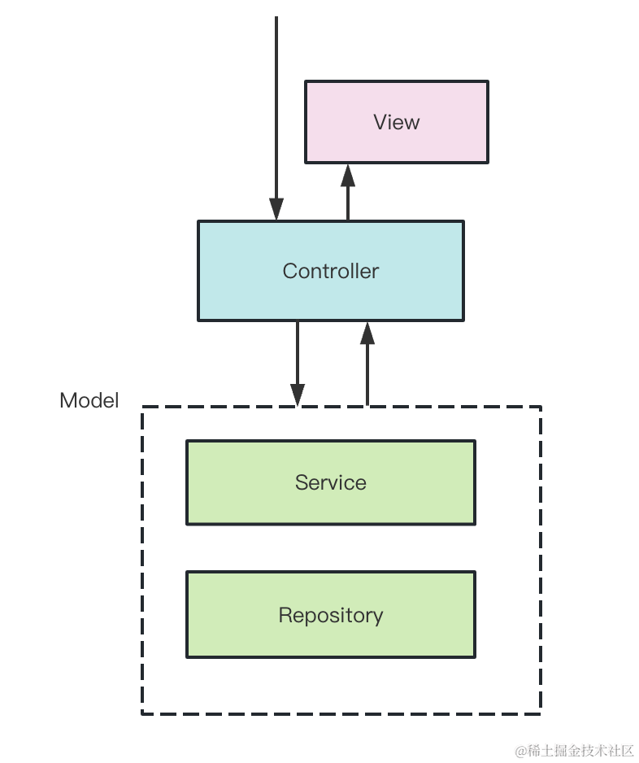
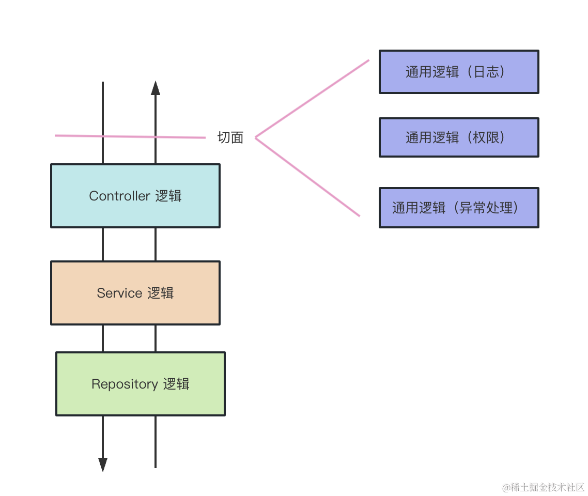
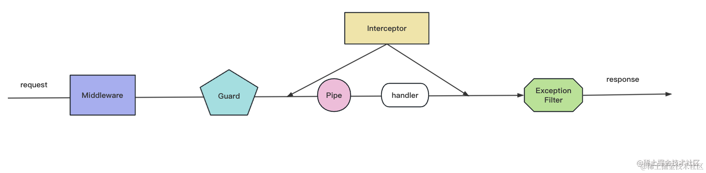
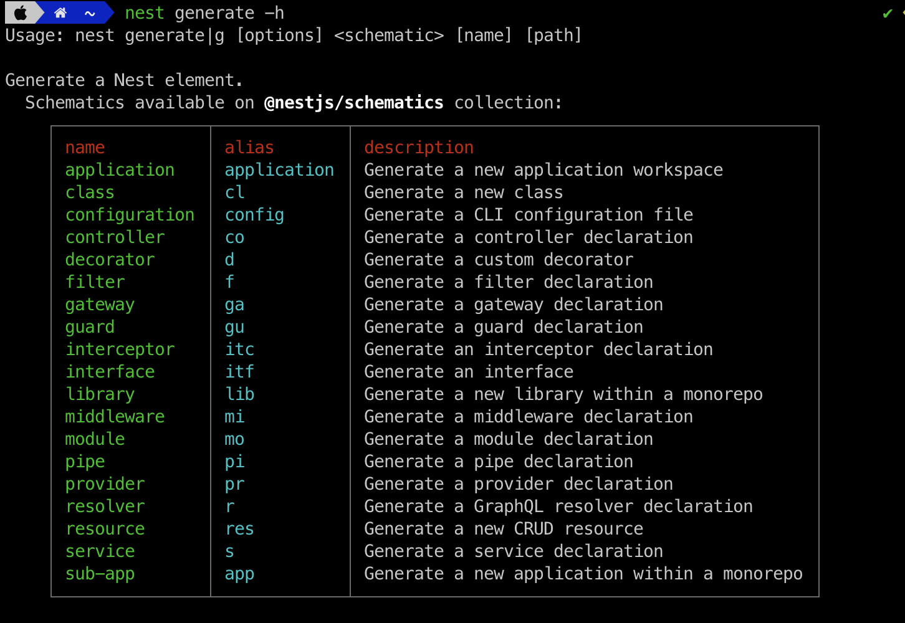
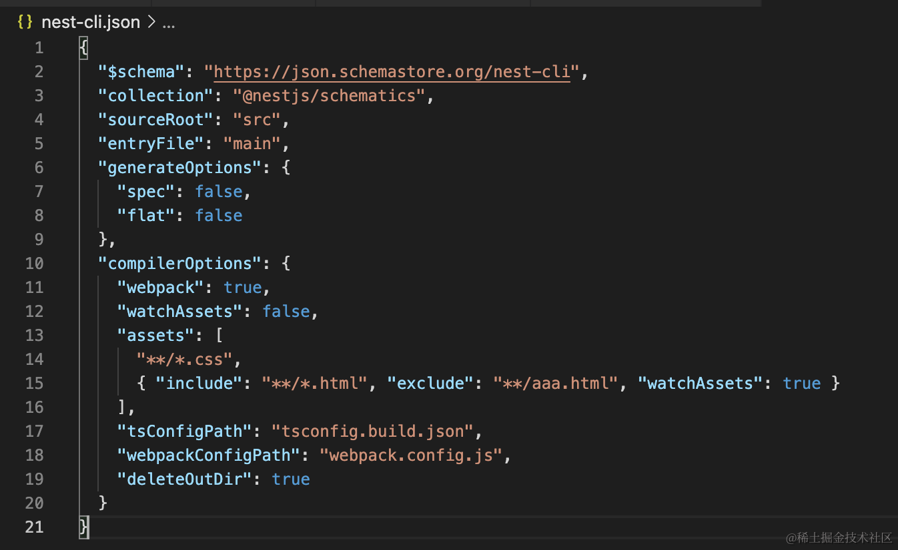

# nestjs


## Nest 基础概念扫盲

Nest 实现了一套依赖注入机制，叫做 IoC。

### IOC（Inverse Of Control 反转控制）

就是你只需要声明依赖了啥就行，不需要手动去 new 依赖，Nest 的 IoC 容器会自动给你创建并注入依赖。
- controller 是处理路由，解析请求参数的。
- service 是处理业务逻辑的，比如操作数据库。
- dto 是封装请求参数的。
- entities 是封装对应数据库表的实体的。

nest 应用跑起来后，会从 AppModule 开始解析，初始化 IoC 容器，加载所有的 service 到容器里，然后解析 controller 里的路由，接下来就可以接收请求了。



其实这种架构叫做 MVC 模式，也就是 model、view、controller。

controller 接收请求参数，交给 model 处理（model 就是处理 service 业务逻辑，处理 repository 数据库访问），然后返回 view，也就是响应。


### AOP
Nest 提供了 AOP （Aspect Oriented Programming 面向切面编程）的机制。



具体来说，有 Middleware、Guard、Interceptor、Pipe、Exception Filter 这五种。



它们都是在目标 controller 的 handler 前后，额外加一段逻辑的。


### 总结
- controller：控制器，用于处理路由，解析请求参数
- handler：控制器里处理路由的方法
- service：实现业务逻辑的地方，比如操作数据库等
- dto：data transfer object，数据传输对象，用于封装请求体里数据的对象
- module：模块，包含 controller、service 等，比如用户模块、书籍模块
- entity：对应数据库表的实体
- ioc：Inverse of Controller，反转控制或者叫依赖注入，只要声明依赖，运行时 Nest 会自动注入依赖的实例
- aop：Aspect Oriented Programming 面向切面编程，在多个请求响应流程中可以复用的逻辑，比如日志记录等，具体包含 middleware、interceotor、guard、exception filter、pipe
- nest cli：创建项目、创建模块、创建 controller、创建 service 等都可以用这个 cli 工具来做


## Nest CLI
安装命令：
```bash
npm install -g @nestjs/cli

nest new 项目名

# 更新
npm update -g @nestjs/cli
```


### nest new
创建一个新的 nest 项目。

- `--skip-git` 和 `--skip-install` 跳过 git 的初始化，跳过 npm install。
- `--package-manager` 是指定包管理器的，之前创建项目的时候会让我们选择 `npm/yarn/pnpm`。
- `--language` 可以指定 typescript 和 javascript，一般我们都选择 ts，用默认的就好。
- `--strict` 是指定 ts 的编译选项是否开启严格模式的（默认是 false）。


### nest generate
nest 命令除了可以生成整个项目外，还可以生成一些别的代码，比如 controller、service、module 等。

```bash
# 生成 module
nest generate module aaa

# 生成 controller、service 等代码
nest generate controller aaa
nest generate service aaa

# 创建一个中间件 --no-spec 是不生成测试文件，--flat 是平铺，不生成目录。
nest g middleware log --no-spec --flat
# 创建一个守卫 --no-spec 是不生成测试文件，--flat 是平铺，不生成目录。
nest g guard login --no-spec --flat
# 创建一个拦截器 --no-spec 是不生成测试文件，--flat 是平铺，不生成目录。
nest g interceptor time --no-spec --flat
# 创建一个管道，用于验证请求参数的格式。 --no-spec 是不生成测试文件，--flat 是平铺，不生成目录。
nest g pipe validate --no-spec --flat
# 创建一个异常过滤器 --no-spec 是不生成测试文件，--flat 是平铺，不生成目录。
nest g filter test --no-spec --flat


# 完整生成一个模块的代码
nest generate resource xxx
```

**nest generate 其他命令**


**选项**
- `--flat` 和 `--no-flat` 是指定是否生成对应目录的
- `--spec` 和 `--no-spec` 是指定是否生成测试文件
- `--skip-import` 是指定不在 AppModule 里引入
- `--project` 是指定生成代码在哪个子项目的


### nest build
用来构建项目的。

--wepback 和 --tsc 是指定用什么编译，默认是 tsc 编译，也可以切换成 webpack。


### nest-cli.json


webpack 设置为 false 就是用 tsc 了。

deleteOutDir 设置为 true，每次 build 都会都清空 dist 目录。

而 assets 是指定 nest build 的时候，把那些非 js、ts 文件也复制到 dist 目录下。

可以通过 include、exclude 来精确匹配，并且可以单独指定是否 watchAssets。

不过只支持 src 下文件的复制，如果是非 src 下的，可以自己写脚本复制。


### nest start
- `--watch` 是最常用的选项了，也就是改动文件之后自动重新 build。
- `--debug` 是启动调试的 websocket 服务，用来 debug。
- `--exec` 可以指定用什么来跑，默认是用 node 跑，你也可以切换别的 runtime。


## 5 种 HTTP 数据传输方式
- `url param`： url 中的参数，Nest 中使用 `@Param` 来取。
- `query`：url 中 ? 后的字符串，Nest 中使用 `@Query` 来取。
- `form urlencoded`： 类似 query 字符串，只不过是放在 body 中。Nest 中使用 `@Body` 来取，axios 中需要指定 content type 为 `application/x-www-form-urlencoded`，并且对数据用 qs 或者 query-string 库做 url encode。
- `json`： json 格式的数据。Nest 中使用 `@Body` 来取，axios 中不需要单独指定 content type，axios 内部会处理。
- `form data`：通过 ----- 作为 boundary 分隔的数据。主要用于传输文件，Nest 中要使用 FilesInterceptor 来处理其中的 binary 字段，用 `@UseInterceptors` 来启用，其余字段用 `@Body` 来取。axios 中需要指定 content type 为 `multipart/form-data`，并且用 FormData 对象来封装传输的内容。


## 课程
### Nest 基础概念扫盲
比如 controller、handler、service、dto、module、entity、ioc、aop、nest cli 等。
- `controller`：控制器，用于处理路由，解析请求参数
- `handler`：控制器里处理路由的方法
- `service`：实现业务逻辑的地方，比如操作数据库等
- `dto`：data transfer object，数据传输对象，用于封装请求体里数据的对象
- `module`：模块，包含 controller、service 等，比如用户模块、书籍模块
- `entity`：对应数据库表的实体
- `ioc`：Inverse of Controller，反转控制或者叫依赖注入，只要声明依赖，运行时 Nest 会自动注入依赖的实例
- `aop`：Aspect Oriented Programming 面向切面编程，在多个请求响应流程中可以复用的逻辑，比如日志记录等，具体包含 middleware、interceotor、guard、exception filter、pipe
- `nest cli`：创建项目、创建模块、创建 controller、创建 service 等都可以用这个 cli 工具来做


### 快速掌握 Nest CLI
nest 在 @nestjs/cli 包里提供了 nest 命令，它可以用来做很多事情：
- 生成项目结构和各种代码
- 编译代码
- 监听文件变动自动编译
- 打印项目依赖信息

也就是这些子命令：
- `nest new` 快速创建项目
- `nest generate` 快速生成各种代码
- `nest build` 使用 tsc 或者 webpack 构建代码
- `nest start` 启动开发服务，支持 watch 和调试
- `nest info` 打印 node、npm、nest 包的依赖版本

并且，很多选项都可以在 nest-cli.json 里配置，比如 generateOptions、compilerOptions 等。

学会用 nest cli，是学好 nest 很重要的一步。


### 5 种 HTTP 数据传输方式
我们用 axios 发送请求，使用 Nest 起后端服务，实现了 5 种 http/https 的数据传输方式：

其中前两种是 url 中的：
- `url param`： url 中的参数，Nest 中使用 @Param 来取
- `query`：url 中 ? 后的字符串，Nest 中使用 @Query 来取 

后三种是 body 中的：
- `form urlencoded`： 类似 query 字符串，只不过是放在 body 中。Nest 中使用 @Body 来取，axios 中需要指定 content type 为 application/x-www-form-urlencoded，并且对数据用 qs 或者 query-string 库做 url encode
- `json`： json 格式的数据。Nest 中使用 @Body 来取，axios 中不需要单独指定 content type，axios 内部会处理。
- `form data`：通过 ----- 作为 boundary 分隔的数据。主要用于传输文件，Nest 中要使用 FilesInterceptor 来处理其中的 binary 字段，用 @UseInterceptors 来启用，其余字段用 @Body 来取。axios 中需要指定 content type 为 multipart/form-data，并且用 FormData 对象来封装传输的内容。

这 5 种 http 的传输数据的方式覆盖了绝大多数开发场景，如果你想进阶全栈，理解这 5 种接口是首先要做到的。


### IOC 解决了什么痛点问题？
后端系统有很多的对象，这些对象之间的关系错综复杂，如果手动创建并组装对象比较麻烦，所以后端框架一般都提供了 IoC 机制。

IoC 机制是在 class 上标识哪些是可以被注入的，它的依赖是什么，然后从入口开始扫描这些对象和依赖，自动创建和组装对象。

Nest 里通过 @Controller 声明可以被注入的 controller，通过 @Injectable 声明可以被注入也可以注入别的对象的 provider，然后在 @Module 声明的模块里引入。

并且 Nest 还提供了 Module 和 Module 之间的 import，可以引入别的模块的 provider 来注入。

虽然 Nest 这套实现了 IoC 的模块机制看起来繁琐，但是却解决了后端系统的对象依赖关系错综复杂的痛点问题。


### 如何调试 Nest 项目
`代码库：debug-nest-source`

vscode 调试 --> 创建 launch.json 文件:
```json
{
    "version": "0.2.0",
    "configurations": [
        {
            "name": "Launch via NPM",
            "request": "launch",
            "runtimeArgs": [
                "run-script",
                "start:dev"
            ],
            "runtimeExecutable": "npm",
            "console": "integratedTerminal",
            "skipFiles": [
                "<node_internals>/**"
            ],
            "type": "node",
            "cwd": "${workspaceFolder}/debug-nest-source"
        },
    ]
}
```
0
#### 总结
复杂的代码需要用断点调试查看调用栈和作用域，也就是代码的执行路线，然后单步执行。

node 代码可以加上 --inspect 或者 --inspect-brk 启动调试 ws 服务，然后用 Chrome DevTools 或者 vscode debugger 连上来调试。

nest 项目的调试也是 node 调试，可以使用 nest start --debug 启动 ws 服务，然后在 vscode 里 attach 上来调试，也可以添加个调试配置来运行 npm run start:dev。

nest 项目最方便的调试方式还是在 VSCode 里添加 npm run start:dev 的调试配置。

此外，我们还理解了 logpoint、条件断点、异常断点等断点类型。

学会了 nest 项目的调试，就可以直接在代码里打断点了。


### 使用多种 Provider，灵活注入对象

一般情况下，provider 是通过 @Injectable 声明，然后在 @Module 的 providers 数组里注册的 class。

默认的 token 就是 class，这样不用使用 @Inject 来指定注入的 token。

但也可以用字符串类型的 token，不过注入的时候要用 @Inject 单独指定。

除了可以用 useClass 指定注入的 class，还可以用 useValue 直接指定注入的对象。

如果想动态生成对象，可以使用 useFactory，它的参数也注入 IOC 容器中的对象，然后动态返回 provider 的对象。

如果想起别名，可以用 useExisting 给已有的 token，指定一个新 token。

灵活运用这些 provider 类型，就可以利用 Nest 的 IOC 容器中注入任何对象。


### 全局模块和生命周期
`代码库：global-and-lifecycle`


全局模块和生命周期。

模块可以通过 @Global 声明为全局的，这样它 exports 的 provider 就可以在各处使用了，不需要 imports。

provider、controller、module 都支持启动和销毁的生命周期函数，这些生命周期函数都支持 async 的方式。

可以在其中做一些初始化、销毁的逻辑，比如 onApplicationShutwon 里通过 moduleRef.get 取出一些 provider，执行关闭连接等销毁逻辑。

**执行顺序：先调用模块内的 controller、provider 的 lifecycle-xxx 方法，然后调用 module 的 lifecycle-xxx 方法**

全局模块、生命周期、moduleRef 都是 Nest 很常用的功能。


### AOP 架构有什么好处？
`代码库：aop-test`

MVC（Model-View-Controller 架构架构）：


AOP （Aspect Oriented Programming）面向切面编程的能力：


几种 AOP 机制的调用顺序：


Nest 基于 express 这种 http 平台做了一层封装，应用了 MVC、IOC、AOP 等架构思想。

MVC 就是 Model、View Controller 的划分，请求先经过 Controller，然后调用 Model 层的 Service、Repository 完成业务逻辑，最后返回对应的 View。

IOC 是指 Nest 会自动扫描带有 @Controller、@Injectable 装饰器的类，创建它们的对象，并根据依赖关系自动注入它依赖的对象，免去了手动创建和组装对象的麻烦。

AOP 则是把通用逻辑抽离出来，通过切面的方式添加到某个地方，可以复用和动态增删切面逻辑。

Nest 的 Middleware、Guard、Interceptor、Pipe、ExceptionFilter 都是 AOP 思想的实现，只不过是不同位置的切面，它们都可以灵活的作用在某个路由或者全部路由，这就是 AOP 的优势。

我们通过源码来看了它们的调用顺序，Middleware 是 Express 的概念，在最外层，到了某个路由之后，会先调用 Guard，Guard 用于判断路由有没有权限访问，然后会调用 Interceptor，对 Contoller 前后扩展一些逻辑，在到达目标 Controller 之前，还会调用 Pipe 来对参数做检验和转换。所有的 HttpException 的异常都会被 ExceptionFilter 处理，返回不同的响应。

Nest 就是通过这种 AOP 的架构方式，实现了松耦合、易于维护和扩展的架构。


### 一网打尽 Nest 全部装饰器
`代码库：nestjs-demo/all-decorator`

这节我们梳理了下 Nest 全部的装饰器：
- @Module： 声明 Nest 模块
- @Controller：声明模块里的 controller
- @Injectable：声明模块里可以注入的 provider
- @Inject：通过 token 手动指定注入的 provider，token 可以是 class 或者 string
- @Optional：声明注入的 provider 是可选的，可以为空
- @Global：声明全局模块
- @Catch：声明 exception filter 处理的 exception 类型
- @UseFilters：路由级别使用 exception filter
- @UsePipes：路由级别使用 pipe
- @UseInterceptors：路由级别使用 interceptor
- @SetMetadata：在 class 或者 handler 上添加 metadata
- @Get、@Post、@Put、@Delete、@Patch、@Options、@Head：声明 get、post、put、delete、patch、options、head 的请求方式
- @Param：取出 url 中的参数，比如 /aaa/:id 中的 id
- @Query: 取出 query 部分的参数，比如 /aaa?name=xx 中的 name
- @Body：取出请求 body，通过 dto class 来接收
- @Headers：取出某个或全部请求头
- @Session：取出 session 对象，需要启用 express-session 中间件
- @HostParm： 取出 host 里的参数
- @Req、@Request：注入 request 对象
- @Res、@Response：注入 response 对象，一旦注入了这个 Nest 就不会把返回值作为响应了，除非指定 passthrough 为true
- @Next：注入调用下一个 handler 的 next 方法
- @HttpCode： 修改响应的状态码
- @Header：修改响应头
- @Redirect：指定重定向的 url
- @Render：指定渲染用的模版引擎


### Nest 如何自定义装饰器
`代码库：nestjs-demo/custom-decorator`

内置装饰器不够用的时候，或者想把多个装饰器合并成一个的时候，都可以自定义装饰器。

方法的装饰器就是传入参数，调用下别的装饰器就好了，比如对 @SetMetadata 的封装。

如果组合多个方法装饰器，可以使用 applyDecorators api。

class 装饰器和方法装饰器一样。

还可以通过 createParamDecorator 来创建参数装饰器，它能拿到 ExecutionContext，进而拿到 reqeust、response，可以实现很多内置装饰器的功能，比如 @Query、@Headers 等装饰器。

通过自定义方法和参数的装饰器，可以让 Nest 代码更加的灵活。


### Metadata 和 Reflector
`代码库：nestjs-demo/metadata-and-reflector`

`nest 的核心实现原理`：**通过装饰器给 class 或者对象添加 metadata，并且开启 ts 的 emitDecoratorMetadata 来自动添加类型相关的 metadata，然后运行的时候通过这些元数据来实现依赖的扫描，对象的创建等等功能。**

Nest 的装饰器的实现原理就是 Reflect.getMetadata、Reflect.defineMetadata 这些 api。通过在 class、method 上添加 metadata，然后扫描到它的时候取出 metadata 来做相应的处理来完成各种功能。

Nest 的 Controller、Module、Service 等等所有的装饰器都是通过 Reflect.meatdata 给类或对象添加元数据的，然后初始化的时候取出来做依赖的扫描，实例化后放到 IOC 容器里。

实例化对象还需要构造器参数的类型，这个开启 ts 的 emitDecoratorMetadata 的编译选项之后， ts 就会自动添加一些元数据，也就是 design:type、design:paramtypes、design:returntype 这三个，分别代表被装饰的目标的类型、参数的类型、返回值的类型。

当然，reflect metadata 的 api 还在草案阶段，需要引入 reflect metadata 的包做 polyfill。

Nest 还提供了 @SetMetadata 的装饰器，可以在 controller 的 class 和 method 上添加 metadata，然后在 interceptor 和 guard 里通过 reflector 的 api 取出来。

理解了 metadata，nest 的实现原理就很容易搞懂了。


### ExecutionContext：切换不同上下文
`代码库：nestjs-demo/argument-host`

为了让 Filter、Guard、Exception Filter 支持 http、ws、rpc 等场景下复用，Nest 设计了 ArgumentHost 和 ExecutionContext 类。

ArgumentHost 可以通过 getArgs 或者 getArgByIndex 拿到上下文参数，比如 request、response、next 等。

更推荐的方式是根据 getType 的结果分别 switchToHttp、switchToWs、swtichToRpc，然后再取对应的 argument。

而 ExecutionContext 还提供 getClass、getHandler 方法，可以结合 reflector 来取出其中的 metadata。

在写 Filter、Guard、Exception Filter 的时候，是需要用到这些 api 的。


### Module 和 Provider 的循环依赖怎么处理？
`代码库：nestjs-demo/module-test`

Module 之间可以相互 imports，Provider 之间可以相互注入，这两者都会形成循环依赖。

解决方式就是两边都用 forwardRef 来包裹下。

它的原理就是 nest 会先创建 Module、Provider，之后再把引用转发到对方，也就是 forward ref。
