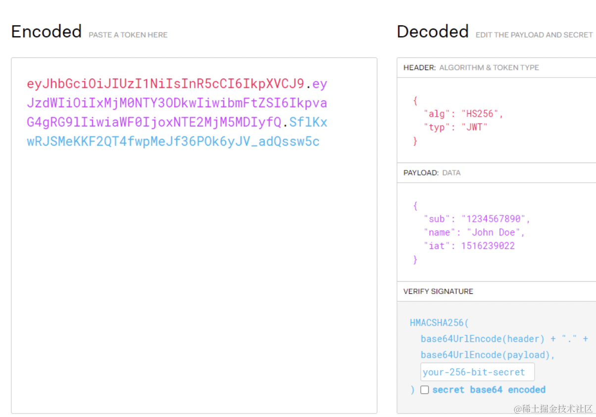

# nestjs 代码


## redis
### docker 中安装redis
在 docker desktop 搜索框搜索 redis，点击 run，把 redis 官方镜像下载并跑起来。

端口映射就是把主机的 6379 端口映射到容器内的 6379 端口，这样就能直接通过本机端口访问容器内的服务了。

指定数据卷，用本机的任意一个目录挂载到容器内的 /data 目录，这样数据就会保存在本机。

```bash
# 在docker命令行
# 在 terminal 输入 redis-cli，进入交互模式
redis-cli
```


### 可视化工具
####  list 类型的数据结构
```bash
# lpush 是 left push 的意思，执行后会从左到右添加到列表中。
lpush list1 111
# rpush 是 right push 的意思，执行后会从右往左添加到列表中。
rpush list1 222
# lpop 和 rpop 自然是从左边和从右边删除数据。
lpop list1
rpop list1
# 查看 list 数据
# 输入一段 range，结尾下标为 -1 代表到最后。lrange list1 0 -1 就是查询 list1 的全部数据。
lrange list1 0 -1
```


#### set
set 的特点是无序并且元素不重复。

set 只能去重、判断包含，不能对元素排序。

```bash
# 添加元素
sadd set1 111
sadd set1 222

# 通过 sismember 判断是否是集合中的元素
sismember set1 111
```


#### zset
如果排序、去重的需求，比如排行榜

```bash
# 添加
zadd zset1 5 guang
zadd zset1 4 dong
zadd zset1 3 xxx
zadd zset1 6 yyyy

# 通过 zrange 命令取数据，比如取排名前三的数据
zrange zset1 0 2
```


#### hash
和我们用的 map 一样。

```bash
# 添加
hset hash1 key1 1
hset hash1 key2 2
hset hash1 key3 3
hset hash1 key4 4
hset hash1 key5 5

# 获取
hget hash1 key3
```


#### geo
geo 的数据结构，就是经纬度信息，根据距离计算周围的人用的。

```bash
# 添加 用 loc 作为 key，分别添加 guangguang 和 dongdong 的经纬度
geoadd loc 13.361389 38.115556 "guangguang" 15.087269 37.502669 "dongdong" 

# 用 geodist 计算两个坐标点的距离
geodist loc guangguang dongdong

# 用 georadius 搜索某个半径内的其他点，传入经纬度、半径和单位
georadius loc 15 37 100 km
georadius loc 15 37 200 km
```

#### expire 命令
一般 redis 的 key 我们会设置过期时间，通过 expire 命令。

```bash
# 设置过期时间
expire dong1 30

# 想查剩余过期时间使用 ttl
ttl list1
```


### 总结
因为 mysql 存在硬盘，并且会执行 sql 的解析，会成为系统的性能瓶颈，所以我们要做一些优化。

常见的就是在内存中缓存数据，使用 redis 这种内存数据库。

它是 key、value 的格式存储的，value 有很多种类型，比如 string、list、set、sorted set(zset)、hash、geo 等。

灵活运用这些数据结构，可以完成各种需求，比如排行榜用 zset、阅读数点赞数用 string、附近的人用 geo 等。

而且这些 key 都可以设置过期时间，可以完成一些时效性相关的业务。

用官方 GUI 工具 RedisInsight 可以可视化的操作它，很方便。

redis 几乎和 mysql 一样是后端系统的必用中间件了，它除了用来做数据库的缓存外，还可以直接作为数据存储的地方。

学会灵活使用 redis，是后端开发很重要的一步。


### 资料
[redis 可视化工具](https://redis.io/thank-you/redisinsight-the-best-redis-gui-35/)

[redis 命令](https://redis.io/docs/latest/commands/)


## 两种登录状态保存方式：JWT、Session
那如何实现的这种登录状态的保存呢？

这个问题的解决有两种方案：
- 服务端存储的 session + cookie 的方案
- 客户端存储的 jwt token 的方案

但这两种方式也都有各自的缺点。


### 服务端存储的 session + cookie

#### 小节
session + cookie 的给 http 添加状态的方案是服务端保存 session 数据，然后把 id 放入 cookie 返回，cookie 是自动携带的，每个请求可以通过 cookie 里的 id 查找到对应的 session，从而实现请求的标识。这种方案能实现需求，但是有 CSRF、分布式 session、跨域等问题，不过都是有解决方案的。


### 客户端存储的 token
token 的方案常用 json 格式来保存，叫做 json web token，简称 JWT。


如图JWT 是由 header、payload、verify signature 三部分组成的：

header 部分保存当前的加密算法，payload 部分是具体存储的数据，verify signature 部分是把 header 和 payload 还有 salt 做一次加密之后生成的。（salt，盐，就是一段任意的字符串，增加随机性）

把状态数据都保存在 payload 部分，这样就实现了有状态的 http:


### JWT 的问题：
#### 安全性
因为 JWT 把数据直接 Base64 之后就放在了 header 里，那别人就可以轻易从中拿到状态数据，比如用户名等敏感信息，也能根据这个 JWT 去伪造请求。

所以 JWT 要搭配 https 来用，让别人拿不到 header。

#### 性能
JWT 把状态数据都保存在了 header 里，每次请求都会带上，比起只保存个 id 的 cookie 来说，请求的内容变多了，性能也会差一些。

所以 JWT 里也不要保存太多数据。

#### 没法让 JWT 失效
session 因为是存在服务端的，那我们就可以随时让它失效，而 JWT 不是，因为是保存在客户端，那我们是没法手动让他失效的。

比如踢人、退出登录、改完密码下线这种功能就没法实现。

但也可以配合 redis 来解决，记录下每个 token 对应的生效状态，每次先去 redis 查下 jwt 是否是可用的，这样就可以让 jwt 失效。

所以说，JWT 的方案虽然解决了很多 session + cookie 的问题，但也不完美。

**小结下：**

JWT 的方案是把状态数据保存在 header 里，每次请求需要手动携带，没有 session + cookie 方案的 CSRF、分布式、跨域的问题，但是也有安全性、性能、没法控制等问题。


### 总结
http 是无状态的，也就是请求和请求之间没有关联，但我们很多功能的实现是需要保存状态的。

给 http 添加状态有两种方式：
- session + cookie：把状态数据保存到服务端，session id 放到 cookie 里返回，这样每次请求会带上 cookie ，通过 id 来查找到对应的 session。这种方案有 CSRF、分布式 session、跨域的问题。

- jwt：把状态保存在 json 格式的 token 里，放到 header 中，需要手动带上，没有 cookie + session 的那些问题，但是也有安全性、性能、没法手动控制失效的问题。

上面这两种方案都不是完美的，但那些问题也都有解决方案。

常用的方案基本是 session + redis、jwt + redis 这种。

软件领域很多情况下都是这样的，某种方案都解决了一些问题，但也相应的带来了一些新的问题。没有银弹，还是要熟悉它们的特点，根据不同的需求灵活选用。
