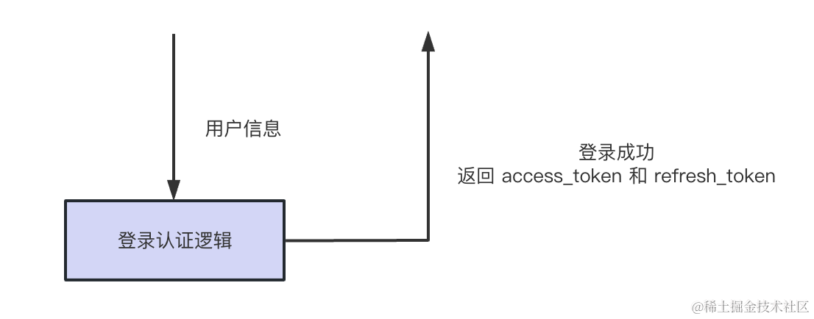
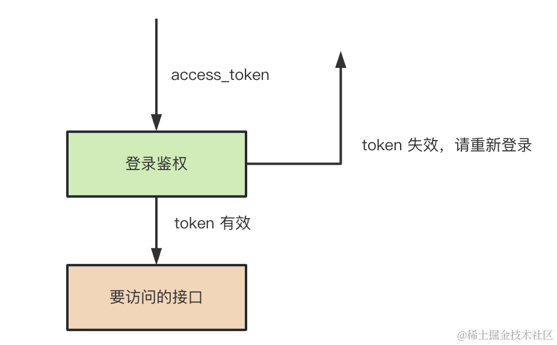
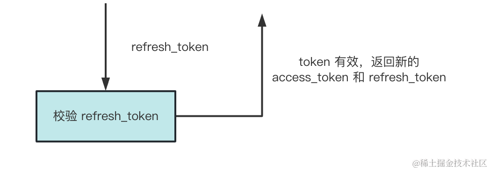

# 基于 access_token 和 refresh_token 实现无感刷新登录状态

web端的项目地址：web-demo/MyReact/RefreshTokenTest


## 命令
### 创建个 nest 项目
```bash
nest new access_token_and_refresh_token -p npm
```


### 命令
```bash
# 创建数据库表
CREATE DATABASE refresh_token_test DEFAULT CHARACTER SET utf8mb4;

# 添加 user 模块
nest g resource user --no-spec

# 安装 typeorm 的依赖
npm install --save @nestjs/typeorm typeorm mysql2

# 运行
npm run start:dev

# 引入下 jwt 的包
npm install --save @nestjs/jwt

# 再实现 LoginGuard 来做登录鉴权
nest g guard login --flat --no-spec

# 在 user 表添加条记录
INSERT INTO `refresh_token_test`.`user` (`id`, `username`, `password`)
  VALUES ('1', 'guang', '123456');
```


## 流程
**登录成功之后，返回两个 token：**


**access_token 用来做登录鉴权：**


**而 refresh_token 用来刷新，拿到新 token：**


access_token 设置 30 分钟过期，而 refresh_token 设置 7 天过期。

这样 7 天内，如果 access_token 过期了，那就可以用 refresh_token 刷新下，拿到新 token。

只要不超过 7 天未访问系统，就可以一直是登录状态，可以无限续签，不需要登录。

如果超过 7 天未访问系统，那 refresh_token 也就过期了，这时候就需要重新登录了。


## 为什么要使用refresh token? 为何会更安全？
普通的token方案，有效期设置过长不安全，过短需要频繁重新登录，体验差。

access_token 有效期短，如果被盗损失更小，所以更安全。

如果refresh_token 被盗了，想刷新access_token的话，也需要提供过期的access_token。盗取难度增加。

同时refresh_token只有在第一次获取和刷新access_token时才会在网络中传输。
被盗的风险远小于access_token，从而在一定程度上更安全了一点。
所谓的更安全就是让盗取信息者更不容易获得而已。


## 总结
这节我们实现了基于 access_token 和 refresh_token 的无感刷新登录状态，也就是无感续签。

access_token 用于身份认证，refresh_token 用于刷新 token，也就是续签。

在登录接口里同时返回 access_token 和 refresh_token，access_token 设置较短的过期时间，比如 30 分钟，refresh_token 设置较长的过期时间，比如 7 天。

当 access_token 失效的时候，可以用 refresh_token 去刷新，服务端会根据其中的 userId 查询用户数据，返回新 token。

在前端代码里，可以在登录之后，把 token 放在 localstorage 里。

然后用 axios 的 interceptors.request 给请求时自动带上 authorization 的 header。

用 intercetpors.response 在响应是 401 的时候，自动访问 refreshToken 接口拿到新 token，然后再次访问失败的接口。

我们还支持了并发请求时，如果 token 过期，会把请求放到队列里，只刷新一次，刷新完批量重发请求。

这就是 token 无感刷新的前后端实现，是用的特别多的一种方案。
