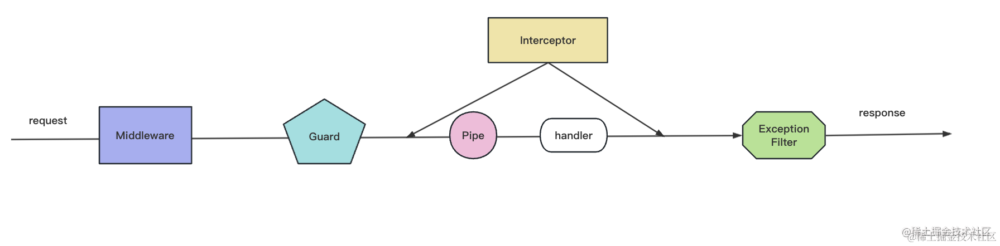

# AOP 架构有什么好处

## 流程

## 总结
Nest 基于 express 这种 http 平台做了一层封装，应用了 MVC、IOC、AOP 等架构思想。

MVC 就是 Model、View Controller 的划分，请求先经过 Controller，然后调用 Model 层的 Service、Repository 完成业务逻辑，最后返回对应的 View。

IOC 是指 Nest 会自动扫描带有 @Controller、@Injectable 装饰器的类，创建它们的对象，并根据依赖关系自动注入它依赖的对象，免去了手动创建和组装对象的麻烦。

AOP 则是把通用逻辑抽离出来，通过切面的方式添加到某个地方，可以复用和动态增删切面逻辑。

Nest 的 Middleware、Guard、Interceptor、Pipe、ExceptionFilter 都是 AOP 思想的实现，只不过是不同位置的切面，它们都可以灵活的作用在某个路由或者全部路由，这就是 AOP 的优势。

> 我们通过源码来看了它们的调用顺序，Middleware 是 Express 的概念，在最外层，到了某个路由之后，会先调用 Guard，Guard 用于判断路由有没有权限访问，然后会调用 Interceptor，对 Contoller 前后扩展一些逻辑，在到达目标 Controller 之前，还会调用 Pipe 来对参数做检验和转换。所有的 HttpException 的异常都会被 ExceptionFilter 处理，返回不同的响应。

Nest 就是通过这种 AOP 的架构方式，实现了松耦合、易于维护和扩展的架构。
