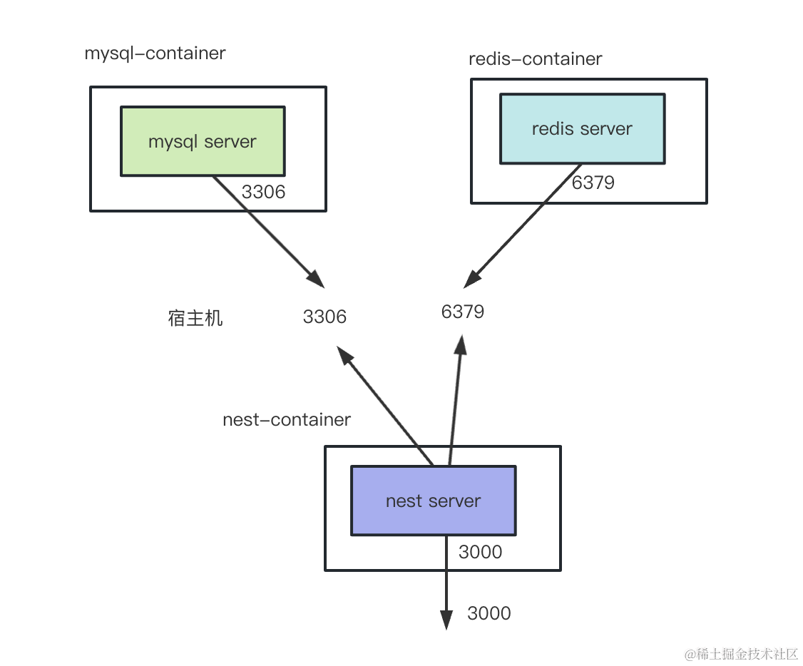
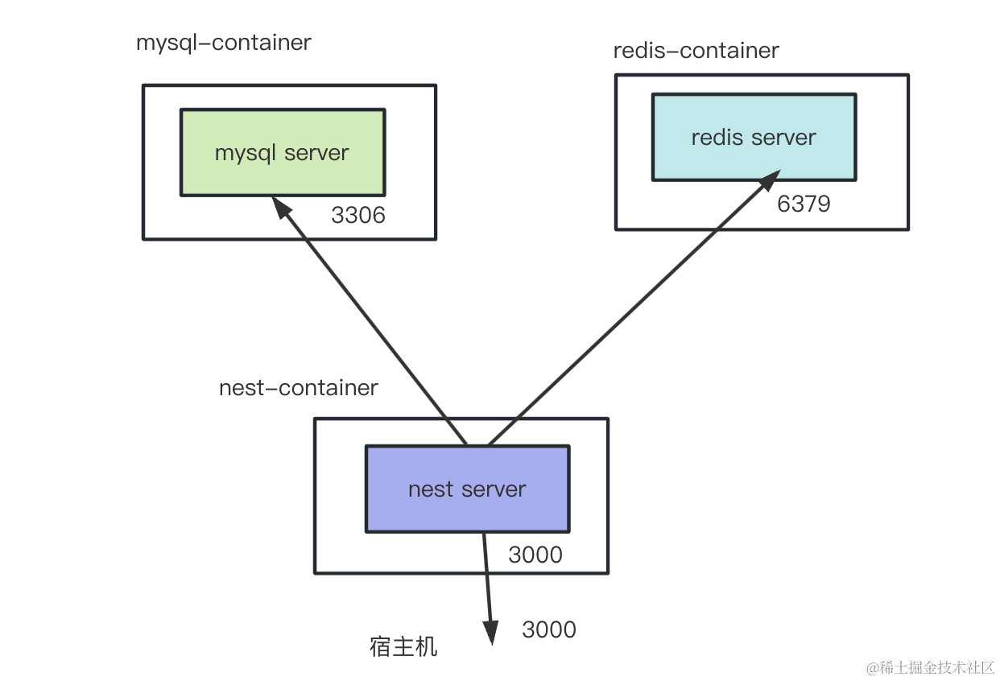
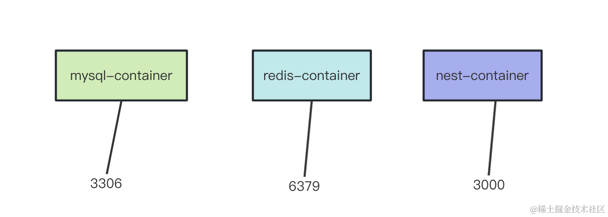
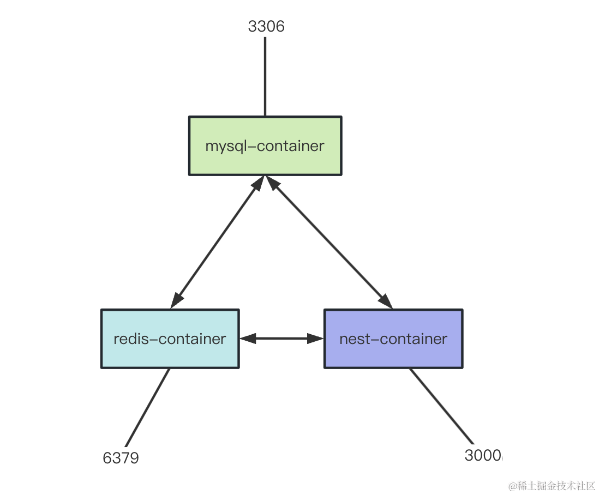

# 为什么要使用 Docker Compose？


## 命令
```bash
# 创建项目
nest new docker-compose-test -p npm

# 安装 tyeporm、mysql2
npm install --save @nestjs/typeorm typeorm mysql2

# 创建数据库表
CREATE DATABASE `aaa` DEFAULT CHARACTER SET utf8mb4;

# 引入 redis
npm install redis

# docker 部署
docker build -t eee .

# 手动跑服务
# 先跑 mysql 的 docker 容器
docker run -d -p 3306:3306 -v D:\docker-demo:/var/lib/mysql --name mysql-container mysql
# 再跑下 redis 的 docker 容器
docker run -d -p 6379:6379 -v D:\docker-demo/redis:/data --name redis-container redis
# 之后跑 nest 的
docker run -d -p 3000:3000 --name nest-container eee
# 看下 3个容器的日志
docker logs mysql-container
docker logs redis-container
docker logs nest-container

# 更换掉nest项目链接mysql和redis的域名，换成ip地址
# 之后重新 build 一个镜像
docker build -t fff .
# 把之前的容器删掉，还有创建的数据库的表
docker rm nest-container
# 再跑 nest 容器
docker run -d -p 3000:3000 --name nest-container fff
# 这时候再查看日志
docker logs nest-container
```


### docker 参数含义
- -d 是 deamon，放到后台运行的意思。

- -p 是端口映射

- -v 是挂载数据卷，把宿主机目录映射到容器内的目录（这里要换成你自己的）

- -name 是容器名

- 可能还需要指定环境变量：-e MYSQL_ROOT_PASSWORD=xxx 设置 root 用户的密码


### docker compose 可以解决这种多个容器的问题
```bash
# 把 3 个容器停掉
docker stop nest-container mysql-container redis-container

# 通过 docker-compose 把它跑起来
docker-compose up
```


#### docker-compose (docker-compose.yml)
每个 services 都是一个 docker 容器，名字随便指定。

这里指定了 nest-app、mysql-container、reids-container 3 个service：

然后 nest-app 配置了 depends_on 其他两个 service。

这样 docker-compose 就会先启动另外两个，再启动这个，这样就能解决顺序问题。

然后 mysql-container、redis-container 的 service 指定了 image 和 ports、volumes 的映射，这些都很容易看懂。

mysql 容器跑的时候还要指定 MYSQL_DATABASE 和 MYSQL_ROOT_PASSWORD 环境变量。

MYSQL_ROOT_PASSWORD 是 root 用户的密码，MYSQL_DATABASE 是会自动创建的 database。

nest-app 指定了 context 下的 dockerfile 路径，端口映射。


## 总结
这节我们通过 docker、docker-compose 两种方式来部署了 nest 项目。

docker 的方式需要手动 docker build 来构建 nest 应用的镜像。

然后按顺序使用 docker run 来跑 mysql、redis、nest 容器。

（要注意 nest 容器里需要使用宿主机 ip 来访问 mysql、redis 服务）

而 docker compose 就只需要写一个 docker-compose.yml 文件，配置多个 service 的启动方式和 depends_on 依赖顺序。

然后 docker-compose up 就可以批量按顺序启动一批容器。

基本上，我们跑 Nest 项目都会依赖别的服务，所以在单台机器跑的时候都是需要用 Docker Compose 的。


# Docker 容器通信的最简单方式：桥接网络

Docker 的实现原理那节我们讲过，Docker 通过 Namespace 的机制实现了容器的隔离，其中就包括 Network Namespace。

因为每个容器都有独立的 Network Namespace，所以不能直接通过端口访问其他容器的服务。

那如果这个 Network Namespace 不只包括一个 Docker 容器呢？？

可以创建一个 Network Namespace，然后设置到多个 Docker 容器，这样这些容器就在一个 Namespace 下了，不就可以直接访问对应端口了？

Docker 确实支持这种方式，叫做桥接网络。


## 命令
```bash
# 通过 docker network 来创建
docker network create common-network

# 然后把之前的 3 个容器停掉、删除，我们重新跑
docker stop mysql-container redis-container nest-container
docker rm mysql-container redis-container nest-container


# 这次跑的时候要指定 --network
# 通过 --network 指定桥接网络为我们刚创建的 common-network。
# mysql 容器
docker run -d --network common-network -v D:\docker-demo:/var/lib/mysql --name mysql-container mysql

# 跑 redis 容器
docker run -d --network common-network -v D:\docker-demo/redis:/data --name redis-container redis

# 然后 docker build
docker build -t mmm .

# docker run
docker run -d --network common-network -p 3000:3000 --name nest-container mmm

# docker logs 看下日志
docker logs nest-container


# Docker Compose 方式
# 修改完 docker-compose.yml
docker-compose down --rmi all
docker-compose up
```


## 图解原理
**之前我们是通过宿主机 ip 来互相访问的：**


**现在可以通过容器名直接互相访问了：**


**本来是 3 个独立的 Network Namespace：**


**桥接之后就这样了：**



## 总结
上节我们是把 mysql、redis 的端口映射到宿主机，然后 nest 的容器里通过宿主机 ip 访问这两个服务的。

但其实有更方便的方式，就是桥接网络。

通过 docker network create 创建一个桥接网络，然后 docker run 的时候指定 --network，这样 3 个容器就可以通过容器名互相访问了。

在 docker-compose.yml 配置下 networks 创建桥接网络，然后添加到不同的 service 上即可。

或者不配置 networks，docker-compose 会生成一个默认的。

实现原理就是对 Network Namespace 的处理，本来是 3个独立的 Namespace，当指定了 network 桥接网络，就可以在 Namespace 下访问别的 Namespace 了。

多个容器之间的通信方式，用桥接网络是最简便的。

