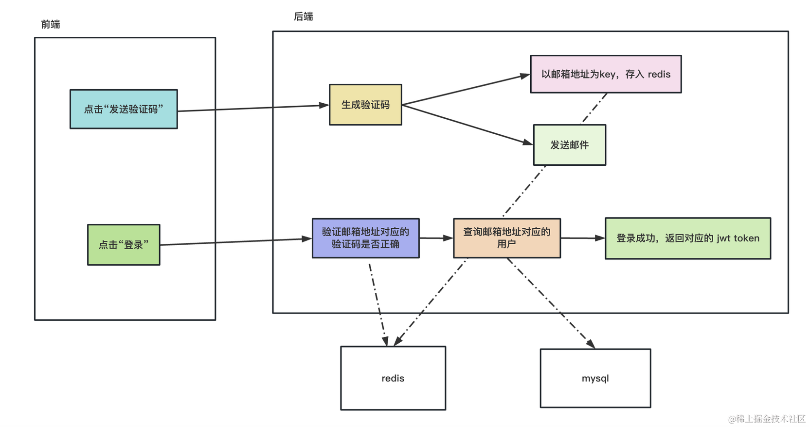

# 实现基于邮箱验证码的登录


## 命令
```bash
# 创建个 nest 项目
nest new email-login-backend -p npm

# 创建 user 模块
nest g resource user

# 安装 typeorm 的依赖
npm install --save @nestjs/typeorm typeorm mysql2

# 添加个 email 模块，这次不用生成 crud 代码了
nest g resource email

# 然后我们安装 nodemailer 包来发邮件
npm install --save nodemailer
npm install --save-dev @types/nodemailer

# 安装下配置模块
npm install --save @nestjs/config

# 创建个 redis 模块
nest g resource redis  --no-spec

# 安装 redis 的包
npm install redis --save

# 引入 class-validator 和 class-transformer
npm install --save class-validator class-transformer
```


## 注意事项
如果你用到了 .env 文件或者 yaml 等文件来配置，需要在 nest-cli.json 里配置下 assets 和 watchAssets。


## 用邮箱验证码验证用户身份的流程是这样的


用户填入邮箱地址，点击发送验证码，后端会生成验证码，发送邮件。并且还要把这个验证码存入 redis，以用户邮箱地址为 key。

之后用户输入验证码，点击登录。

后端根据邮箱地址去 redis 中查询下验证码，和用户传过来的验证码比对下，如果一致，就从 mysql 数据库中查询该用户的信息，放入 jwt 中返回。


## 总结
这节我们实现了基于邮箱验证码的登录。

流程可以看这张图：


综合用到了 mysql、redis、typeorm、nodemailer 等技术。

并且使用 @nestjs/config 包的 ConfigModule 来封装配置。

要注意的是，如果用了 .env 文件，需要保证它在 src 下，并且要在 nest-cli.json 里配置 assets 和 watchAssets，不然 build 的时候不会复制到 dist 下。

