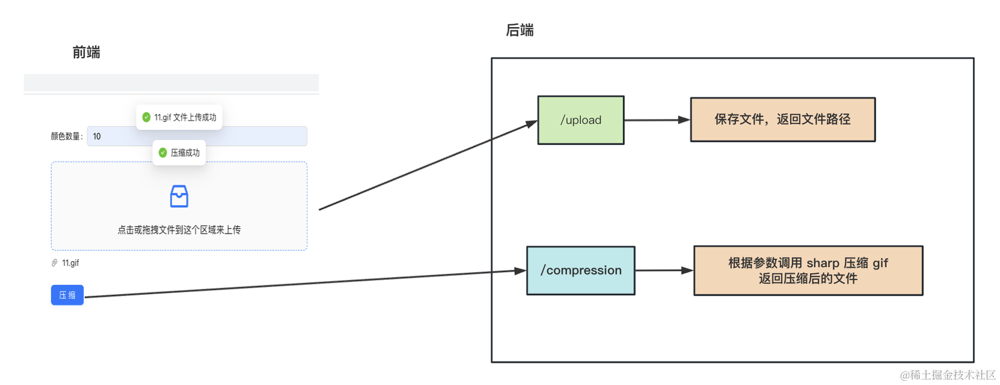

# 基于 sharp 实现 gif 压缩工具


## 命令
```bash
# 创建项目
nest new gif-compression-backend

# 安装需要的 ts 类型的包
npm install -D @types/multer

# 安装 sharp 来实现压缩
npm install --save sharp
```


## 总结
使用sharp包 压缩 gif 图片。

它是用来处理各种图片的，调整大小、旋转等等，我们只用它的 gif 压缩的功能。

然后我们也做了一个网站，前端 react + antd，后端 nest + sharp。

后端提供一个 /upload 接口用于上传文件，返回文件路径。

又提供了一个 /compression 接口用来压缩 gif，返回压缩后的文件。

整个流程如下：



其实最好再做一步: 把这个应用通过 dockerfile 来 build 成 docker 镜像，随时用，随时跑。

再需要压缩图片的时候，不用花钱买会员了，直接用自己的压缩工具就好了。
