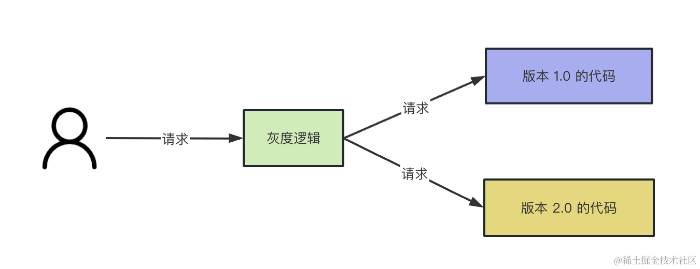
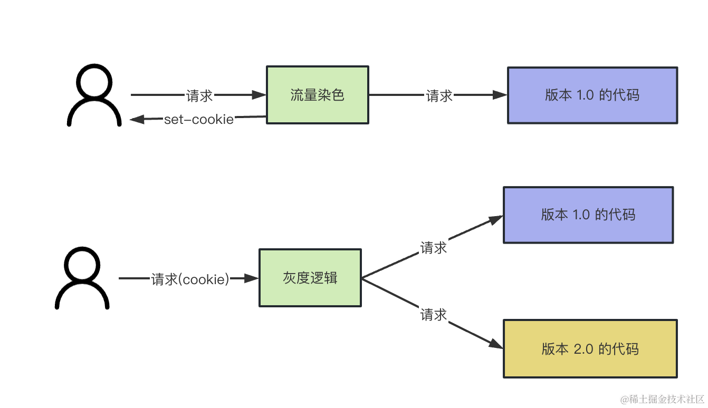

# gray test

关联nginx的配置：nodejs-basic/src/src/gray-test

简单流程：

## 流程

### 完整的灰度流程是这样的：

第一次请求的时候，会按照设定的比例随机对流量染色，也就是设置不同 cookie。

再次访问的时候会根据 cookie 来走到不同版本的代码。

其中，后端代码会根据 cookie 标识来请求不同的服务（或者同一个服务走不同的 if else），前端代码可以根据 cookie 判断走哪段逻辑。

这就实现了灰度功能，可以用来做 5% 10% 50% 100% 这样逐步上线的灰度上线机制。

也可以用来做产品的 AB 实验。

公司里都会用这样的灰度系统。

## 总结
新版本代码的上线基本都会用灰度系统，可以逐步放量的方式来保证上线过程不会出大问题，也可以用来做产品 AB 实验。

我们可以用 nginx 实现这样的功能。

nginx 有反向代理的功能，可以转发请求到应用服务器，也叫做网关层。

我们可以在这一层根据 cookie 里的 version 字段来决定转发请求到哪个服务。

在这之前，还需要按照比例来给流量染色，也就是返回不同的 cookie。

不管灰度系统做的有多复杂，底层也就是流量染色、根据标记转发流量这两部分，我们完全可以自己实现一个。
