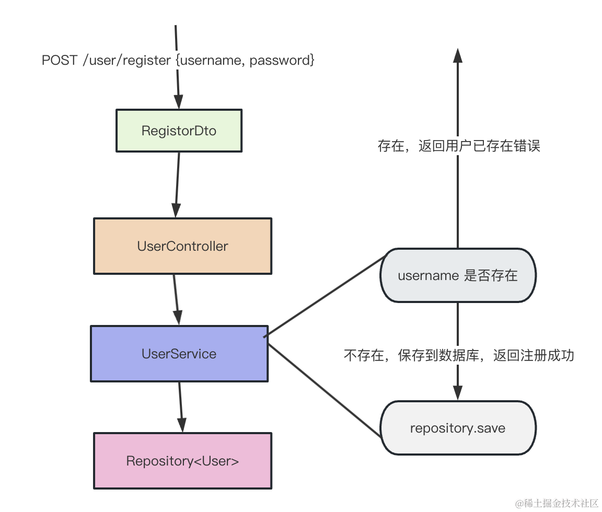
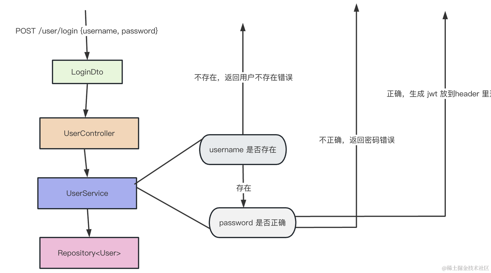
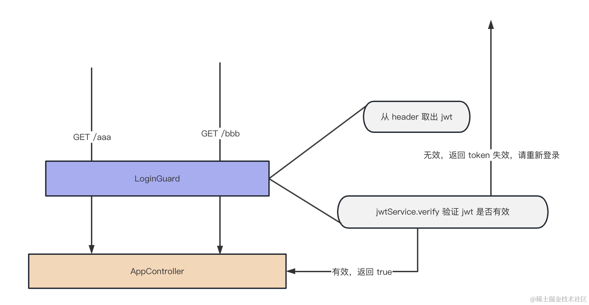

# MySQL + TypeORM + JWT 实现登录注册


## 命令
### 创建个新的 database
create schema 或者 create database 都可以。

指定默认字符集 ，这样创建表的时候就不用指定字符集了。

utf8 最多存 3 个字节的字符，而 utf8mb4 最多 4 个字符，可以存储一些 emoji 等特殊字符。

```bash
CREATE SCHEMA login_test DEFAULT CHARACTER SET utf8mb4
```


### 创建个 nest 项目
```bash
# 创建个 nest 项目
nest new login-and-register -p npm

# 安装 typeorm 相关的包
npm install --save @nestjs/typeorm typeorm mysql2

# 创建个 user 的 CRUD 模块
nest g resource user

# 运行
npm run start:dev

# 安装 @nestjs/jwt 的包
npm install @nestjs/jwt

# 可以加个 Guard 来限制访问
nest g guard login --no-spec --flat

# 对参数做校验
# 安装 class-validator 和 class-transformer 的包
pm install class-validator class-transformer
```


## 流程
### 注册流程


### 登录流程


### 接口鉴权



## 总结
这节我们通过 mysql + typeorm + jwt + ValidationPipe 实现了登录注册的功能。

typeorm 通过 @PrimaryGeneratedKey、@Column、@CreateDateColumn、@UpdateDateColumn 声明和数据库表的映射。

通过 TypeOrmModule.forRoot、TypeOrmModule.forFeature 的动态模块添加数据源，拿到 User 的 Repository。

然后用 Repository 来做增删改查，实现注册和登录的功能。

登录之后，把用户信息通过 jwt 的方式放在 authorization 的 header 里返回。

然后 LoginGuard 里面取出 header 来做验证，token 正确的话才放行。

此外，参数的校验使用 ValidationPipe + class-validator 来实现。

这样，就实现了注册和基于 JWT 的登录功能。
