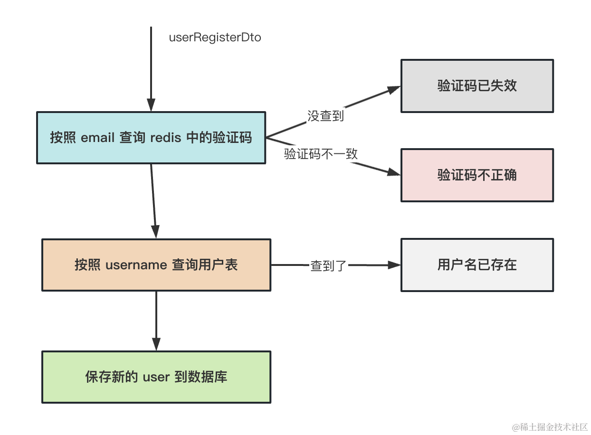
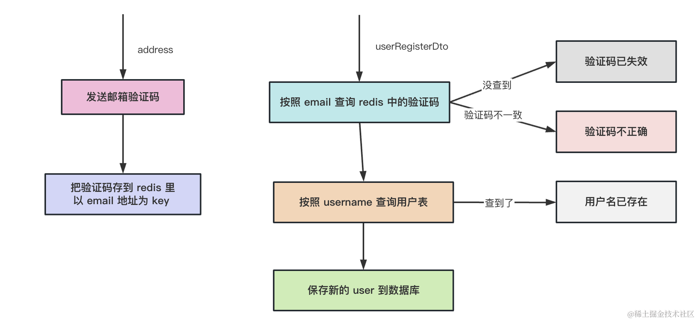

# 会议室预订系统


## 命令
```bash
# 创建个 nest 项目
nest new meeting_room_booking_system_backend

# 安装 typeorm 相关的包
npm install --save @nestjs/typeorm typeorm mysql2

# 生成 user 模块
nest g resource user

# 安装 对请求体做校验 用到的包
npm install --save class-validator class-transformer

# 封装个 redis 模块
nest g module redis
nest g service redis

# 安装 redis 的包
npm install --save redis

# 封装个 email 模块
nest g resource email
# 安装发送邮件用的包
npm install nodemailer --save

# 安装 config 的包
npm install --save @nestjs/config

# 引入 jwt 模块
npm install --save @nestjs/jwt

# 然后我们加上 LoginGuard 和 PermissionGuard 来做鉴权
nest g guard login --flat --no-spec
nest g guard permission --flat --no-spec
```


## 会议室预订系统：用户管理模块--用户注册
### 注入 Repository<User>
注册的逻辑是这样的：


整个注册的流程:



### 总结
这节我们创建了 nest 项目，并引入了 typeorm 和 redis。

创建了 User、Role、Permission 的 entity，通过 typeorm 的自动建表功能，在数据库创建了对应的 3 个表和 2 个中间表。

引入了 nodemailer 来发邮件，如果是线上可以买阿里云或者其他平台的邮件推送服务。

实现了 /user/register 和 /user/register-captcha 两个接口。

/user/register-captcha 会向邮箱地址发送一个包含验证码的邮件，并在 redis 里存一份。

/user/register 会根据邮箱地址查询 redis 中的验证码，验证通过会把用户信息保存到表中。

这样，注册功能就完成了。


## 用户管理模块--配置抽离、登录认证鉴权

### 总结
这节我们实现了配置抽离、基于 jwt 登录、鉴权功能。

配置抽离使用 @nestjs/config 包，把配置放在 src 下的 .env 文件里，然后代码里从 configService 读取配置。

这样可以配置 nest-cli.json 的 assets 和 watchAssets 来自动把 env 文件复制到 dist 目录下。

我们使用代码做的数据初始化，线上要删掉这个接口，用导出的 sql 文件来初始化。

登录成功之后，返回 access_token、refresh_token 还有用户信息、roles、permissions 等。

并支持使用 refreshToken 来刷新 token。

之后使用 LoginGuard、PermissionGuard 来做登录和权限的鉴权，根据 handler 上的 metadata 来确定要不要做鉴权、需要什么权限。

我们还封装了几个自定义装饰器，用于方便的设置 metadata，从 request 取数据注入 handler。

至此，注册、登录、鉴权、配置抽离等功能就完成了。

