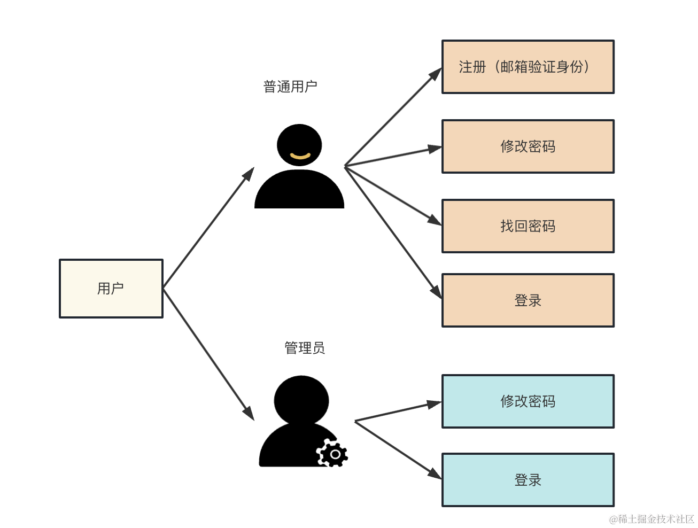
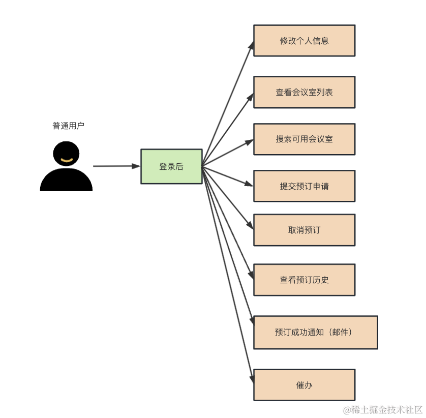
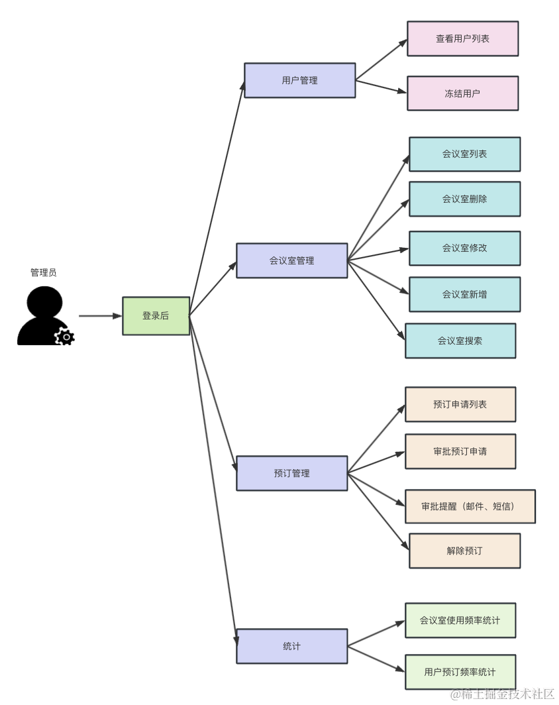
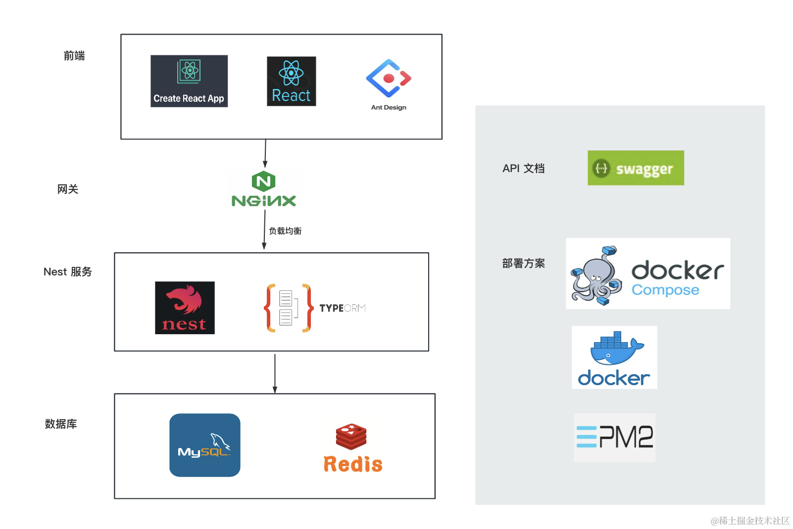
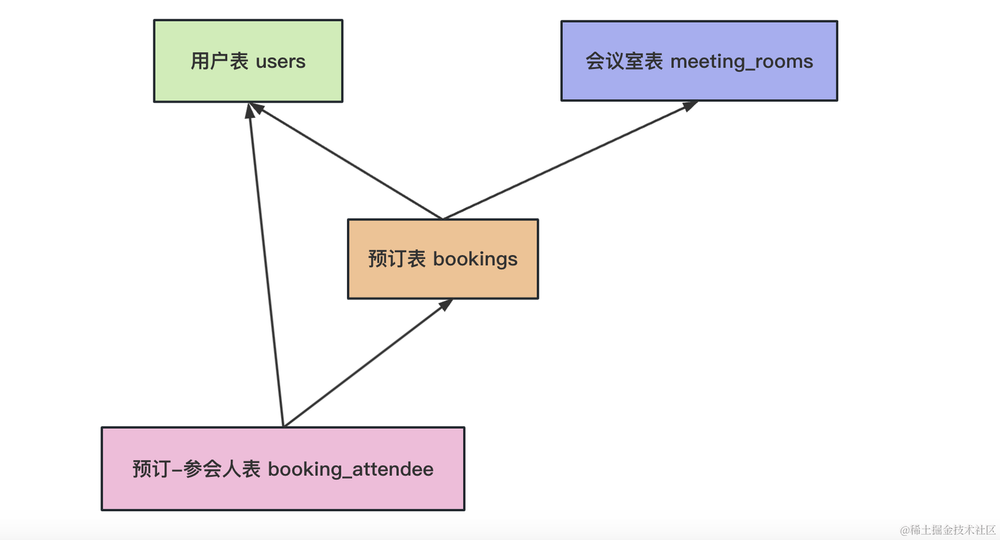
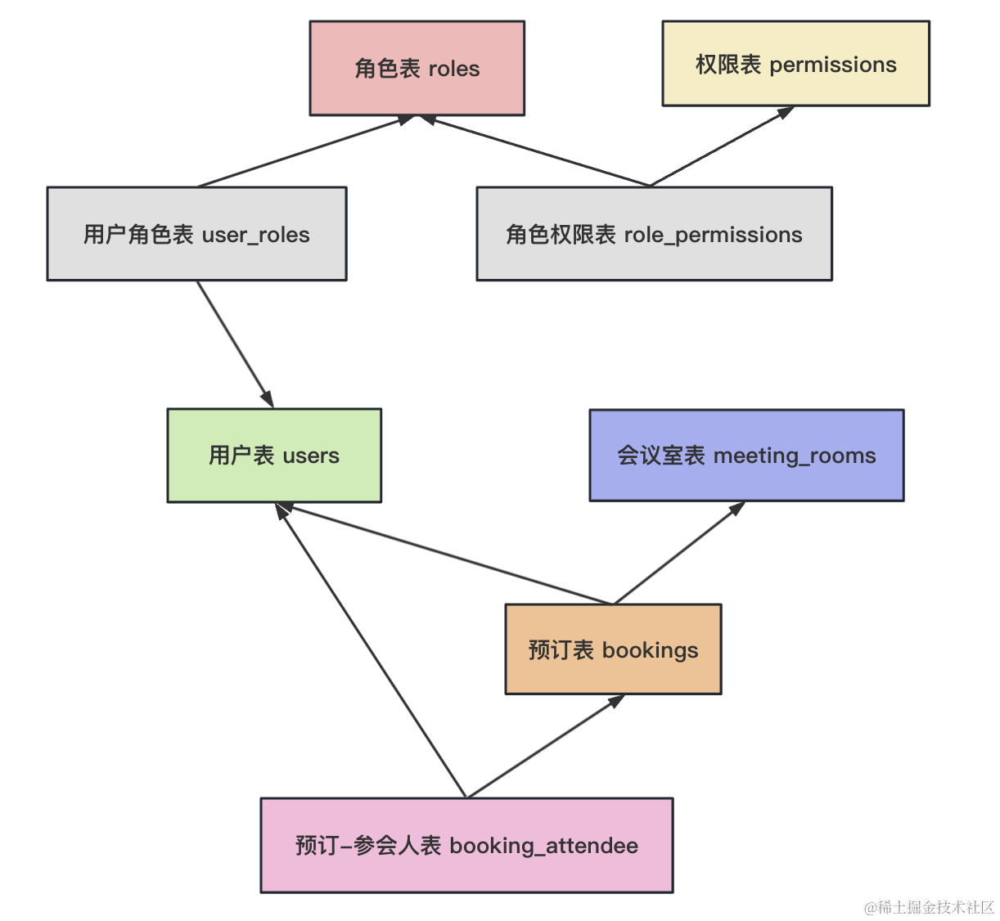

# 会议室预订系统

## 分析下需求: 
首先，用户分为普通用户和管理员两种，各自有不同的功能。

普通用户可以注册，注册的时候会发邮件来验证身份，注册之后就可以登录系统了。

管理员账号密码是内置的，不需要注册。

普通用户可以查看会议室列表、搜索可用会议室、提交预订申请、取消预订、查看预订历史等。

预订成功会邮件通知，就是注册时的那个邮箱。

如果管理员一直没审批，可以催办。

管理员可以查看用户列表、冻结用户、会议室列表、搜索会议室、添加/修改/删除会议室、审批预订申请、查看会议室统计信息等。

整体分为用户管理、会议室管理、预订管理、统计这 4 部分。

如果超过 10 分钟没审批，会发送邮件提醒管理员，如果超过半个小时没审批，会发送短信。

管理员可以解除用户的预订，释放会议室。

冻结用户是指把用户设置为冻结状态，冻结状态的用户不能预订会议室。

统计模块会按照会议室维度和用户维度进行统计，并报表展示。

这些功能涉及到用户端和后台管理两套前端界面。

## 技术栈

前端使用 create-react-app 脚手架创建项目，使用 react + antd 开发页面。

使用 nginx 来网关层，实现静态资源的托管，并且对于动态资源请求做负载均衡。

使用 Nest 开发后端业务逻辑，使用 TypeORM + mysql 来做 CRUD。

使用 Redis 来做缓存，减轻数据库的压力，提高响应性能。

api 文档使用 Swagger 来生成。

部署使用 Docker Compose 的方式。

PM2 可用可不用，不用 PM2 就要启动容器的时候指定重启策略了，这里为了简单我们还是用 PM2。

都是前面讲过的技术，这里只是综合运用。

### 数据库设计
#### 首先是用户表 users：
| 字段名 | 数据类型 | 描述 |
| --- | ----------- | ------ |
| id | INT | 用户ID |
| username | VARCHAR(50) | 用户名 |
| password | VARCHAR(50) | 密码 |
| nick_name | VARCHAR(50) | 昵称 |
| email | VARCHAR(50) | 邮箱 |
| head_pic | VARCHAR(100) | 头像 |
| phone_number | VARCHAR(20) | 手机号 |
| is_frozen | BOOLEAN | 是否被冻结 |
| is_admin | BOOLEAN | 是否是管理员 |
| create_time | DATETIME | 创建时间 |
| update_time | DATETIME | 更新时间 |

用户需要区分普通用户和管理员，所以加了个 is_admin 字段。

#### 然后是会议室表 meeting_rooms：

| 字段名 | 数据类型 | 描述 |
| --- | ----------- | ------ |
| id | INT | 会议室ID |
| name | VARCHAR(50) | 会议室名字 |
| capacity | INT | 会议室容量 |
| location | VARCHAR(50) | 会议室位置 |
| equipment | VARCHAR(50) | 设备 |
| description | VARCHAR(100) | 描述 |
| is_booked | BOOLEAN | 是否被预订 |
| create_time | DATETIME | 创建时间 |
| update_time | DATETIME | 更新时间 |

#### 接下来是预订表 bookings：
| 字段名 | 数据类型 | 描述 |
| --- | ----------- | ------ |
| id | INT | 预订ID |
| user_id | INT | 预订用户ID |
| room_id | INT | 会议室ID |
| start_time | DATETIME | 会议开始时间 |
| end_time | DATETIME | 会议结束时间 |
| status | VARCHAR(20) | 状态（申请中、审批通过、审批驳回、已解除） |
| note | VARCHAR(100) | 备注 |
| create_time | DATETIME | 创建时间 |
| update_time | DATETIME | 更新时间 |

#### 然后是预订-参会人表 booking_attendees：

| 字段名 | 数据类型 | 描述 |
| --- | ----------- | ------ |
| id | INT | ID |
| user_id | INT | 参会用户ID |
| booking_id | INT | 预订ID |

**这几个表的关系如下：**

#### 再加上角色表、权限表，还有 2 个中间表：
**角色表 roles**
| 字段名 | 数据类型 | 描述 |
| --- | ----------- | ------ |
| id | INT | ID |
| name | VARCHAR(20) | 角色名 |

**权限表 permissions**
| 字段名 | 数据类型 | 描述 |
| --- | ----------- | ------ |
| id | INT | ID |
| code | VARCHAR(20) | 权限代码 |
| description | VARCHAR(100) | 权限描述 |

**用户-角色中间表 user_roles**
| 字段名 | 数据类型 | 描述 |
| --- | ----------- | ------ |
| id | INT | ID |
| user_id | INT | 用户 ID |
| role_id | INT | 角色 ID |

**角色-权限中间表 role_permissions**
| 字段名 | 数据类型 | 描述 |
| --- | ----------- | ------ |
| id | INT | ID |
| role_id | INT | 角色 ID |
| permission_id | INT | 权限 ID |

### 模块划分
首先是用户模块，实现普通用户和管理员的登录、注册、信息修改的功能：

#### 大概有这些接口：
| 接口路径 | 请求方式 | 描述 |
| --- | ----------- | ------ |
| /user/login | POST | 普通用户登录 |
| /user/register | POST | 普通用户注册 |
| /user/update | POST | 普通用户个人信息修改 |
| /user/update_password | POST | 普通用户修改密码 |
| /user/admin/login | POST | 管理员登录 |
| /user/admin/update_password | POST | 管理员修改密码 |
| /user/admin/update | POST | 管理员个人信息修改 |
| /user/list | GET | 用户列表 |
| /user/freeze | GET | 冻结用户 |

#### 然后是会议室管理模块：
| 接口路径 | 请求方式 | 描述 |
| --- | ----------- | ------ |
| /meeting_room/list | GET | 会议室列表 |
| /meeting_room/delete/:id | DELETE | 会议室删除 |
| /meeting_room/update/:id | PUT | 会议室更新 |
| /meeting_room/create | POST | 会议室新增 |
| /meeting_room/search | GET | 会议室搜索 |

#### 然后是预订管理模块：
| 接口路径 | 请求方式 | 描述 |
| --- | ----------- | ------ |
| /booking/list | GET | 预订列表 |
| /booking/approve | POST | 审批预订申请 |
| /booking/add | POST | 申请预订 |
| /booking/apply/:id | GET | 通过预订 |
| /booking/reject/:id | GET | 取消预订 |
| /booking/unbind/:id | GET | 解除预订 |
| /booking/history | GET | 预订历史 |
| /booking/urge | GET | 催办 |

#### 然后是统计模块：
| 接口路径 | 请求方式 | 描述 |
| --- | ----------- | ------ |
| /statistics/meeting_room_usage_frequency | GET | 会议室使用频率统计 |
| /statistics/user_booking_frequency | GET | 用户预订频率统计 |

### 角色划分
权限控制使用 RBAC 的方式，有普通用户和管理员两个角色，

两个角色各自可以操作的接口就是上节用例图画的那些：

### 总结
这节我们设计了下技术方案。

技术栈：前端是 antd + react + cra，后端是 nest + typeorm，数据库是 mysql + redis，API 文档用 swagger 生成，部署用 docker compose + pm2，网关使用 nginx。

数据库表有 8 个：用户表 users、会议室表 meeting_rooms、预订表 bookings、预订-参会者表 booking_attendees、角色表 roles、权限表 permissions、用户-角色表 user_roles、角色-权限表 role_permissions。

模块有 4 个：用户管理模块、会议室管理模块、预订管理模块、统计管理模块。

角色有两个：普通用户、管理员，各自拥有的权限按照用例图来。使用 RBAC 来控制接口访问权限。
