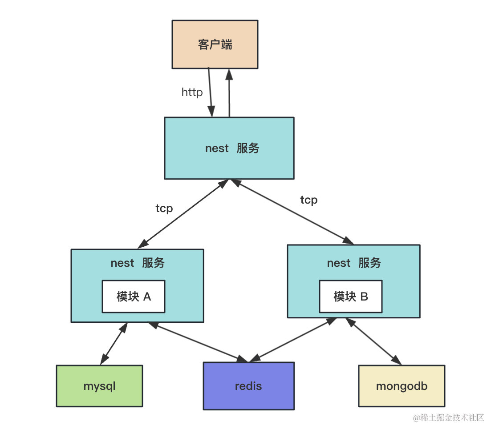

# Nest 如何创建微服务
**微服务**



## 命令
```bash
# 创建个 nest 项目
nest new microservice-test-main
nest new microservice-test-user

# 进入 microservice-test-main
# 安装微服务相关的包
npm install @nestjs/microservices --save

# 进入 microservice-test-user 
# 安装微服务的包
npm install @nestjs/microservices --save
```


## 总结
### 从抓包我们可以得出结论：
- 微服务之间的 tcp 通信的消息格式是 json
- 如果是 message 的方式，需要两边各发送一个 tcp 包，也就是一问一答的方式
- 如果是 event 的方式，只需要客户端发送一个 tcp 的包


### 总结
之前我们一直写的都是单体的 http 服务，这样项目大了以后会难以维护和扩展。

这时候可以通过微服务的方式把业务逻辑拆分到不同的微服务里。

微服务之间通过 tcp 方式通信，在 nest 里需要用到 @nestjs/microservices 这个包。

微服务启动的时候不再调用 NestFactory.create 而是调用 NestFactory.createMicroservice 方法，指定 tcp 的端口。

然后另一个服务里通过 ClientsModule 来注入连接这个微服务的代理对象。

之后分别用 send、emit 方法来调用微服务的 @MessagePattern、@EventPattern 声明的方法。

这就是微服务的创建和通信方式。

我们还通过 wireshark 抓包分析了 tcp 通信的内容，发现微服务之间的通信是基于 json 的。

项目大了之后，为了维护和扩展方便，拆分微服务是很自然的事情。
