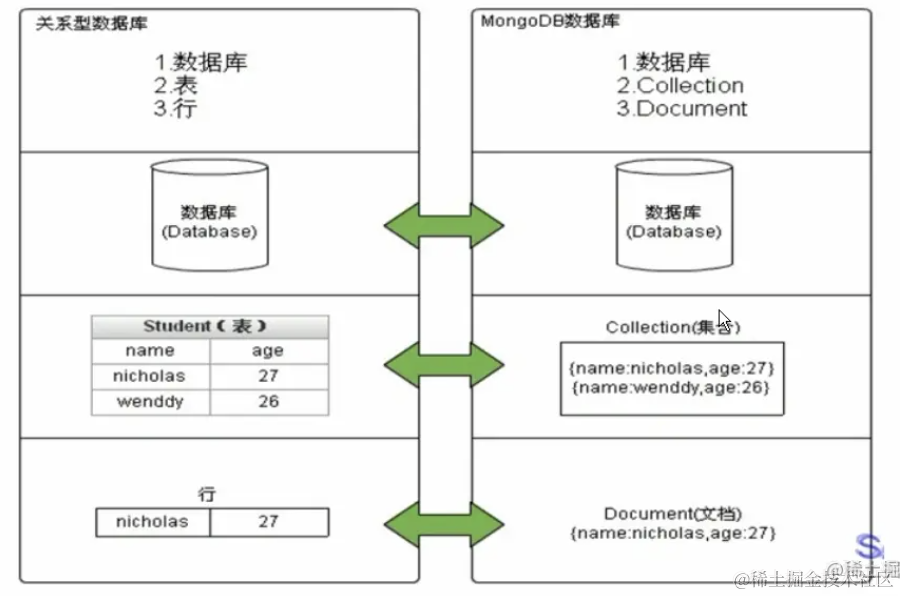

# mongodb

[mongodb 文档](https://www.mongodb.com/docs/mongodb-shell/crud/)

它的 database 下是 collection，collection 包含多个 document。

document 可以是任意结构的，这点和 mysql 的 table 不同。

mongo 是通过 api 来做 CRUD 的，不是用的 sql。

我们过了一遍常用的命令和 api：
```js
// 显示 database
show dbs; 
show databases;

// 切换或者创建 database
use hello-mongo; 

db; // 查看当前 database

// 删除 database
db.dropDatabase(); 

// 创建 collection
db.createCollection('aaa'); 

//删除 collection
db.xxx.drop() 

// 插入 document
db.xxx.insertOne({ name: 'guang', age: 20, phone: '13222222222'});
db.xxx.insertMany([{ name: 'dong', age: 21}, {name: 'xxx', hobbies: ['writing']}]);

// 查询 collection
db.xxx.find({age: 20}); 
db.xxx.findOne({ age: 20});

// 查询所有 collection
db.xxx.findOne(); 

// 使用 in、nin 查询多个值
db.xxx.find({ age: { $in: [20, 21]}}) 
// 使用 and 指定多个条件同时成立
db.xxx.find({ $and: [{age: { $gte: 20 }}, { name: /dong\d/}]}) 
// 使用 or 表示或者
db.xxx.find({ $or: [{age: { $gt: 20 }}, { name: /dong*/}]}) 

// 使用 skip + limit 实现分页
db.xxx.find().skip(1).limit(2) 

// updateOne、updateMany 更新
db.xxx.updateOne({ name: 'guang'}, { $set: {age: 30}, $currentDate: { aaa: true } }) 

// 整体替换
db.xxx.replaceOne({name: 'guang'}, { age: 30}) 

// deleteOne、deleteMany 删除
db.xxx.deleteMany({ age: { $gt: 20 }}); 

db.xxx.count({ name: /guang/})

db.xxx.find().sort({ age: -1, name: 1})
```

当然，平时不用敲 api，用 Mongo Compass 的 GUI 工具操作非常简单。


## mysql vs mongodb
和 mysql 一样，mongodb 也是通过一个个 database 来存储不同数据的，只不过 mysql 的 database 里存的是 table，而 mongo 里存的是 Collection。


