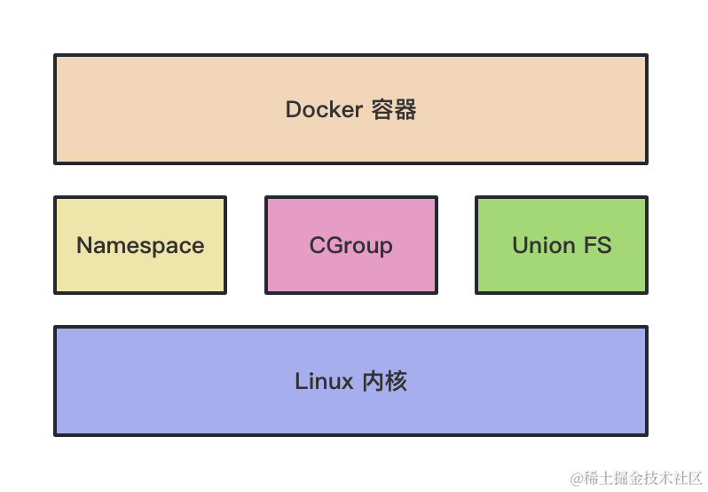

# nest-dockerfile-test

## 文档
```dockerfile
# build stage
FROM node:18 as build-stage

WORKDIR /app

COPY package.json .

RUN npm config set registry https://registry.npmmirror.com/

RUN npm install

COPY . .

RUN npm run build

# production stage
FROM node:18 as production-stage

COPY --from=build-stage /app/dist /app
COPY --from=build-stage /app/package.json /app/package.json

WORKDIR /app

RUN npm install --production

EXPOSE 3000

CMD ["node", "/app/main.js"]
```

通过 FROM 继承镜像的时候，给当前镜像指定一个名字，比如 build-stage。

然后第一个镜像执行 build。

之后再通过 FROM 继承 node 镜像创建一个新镜像。

通过 COPY --from-build-stage 从那个镜像内复制 /app/dist 的文件到当前镜像的 /app 下。

还要把 package.json 也复制过来，然后切到 /app 目录执行 npm install --production 只安装 dependencies 依赖

这个生产阶段的镜像就指定容器跑起来执行 node /app/main.js 就好了。


## Dockerfile 有挺多技巧：

- 使用 alpine 的镜像，而不是默认的 linux 镜像，可以极大减小镜像体积，比如 node:18-alpine3.14 这种
- 使用多阶段构建，比如一个阶段来执行 build，一个阶段把文件复制过去，跑起服务来，最后只保留最后一个阶段的镜像。这样使镜像内只保留运行需要的文件以及 dependencies。
- 使用 ARG 增加构建灵活性，ARG 可以在 docker build 时通过 --build-arg xxx=yyy 传入，在 dockerfile 中生效，可以使构建过程更灵活。如果是想定义运行时可以访问的变量，可以通过 ENV 定义环境变量，值使用 ARG 传入。
- CMD 和 ENTRYPOINT 都可以指定容器跑起来之后运行的命令，CMD 可以被覆盖，而 ENTRYPOINT 不可以，两者结合使用可以实现参数默认值的功能。
- ADD 和 COPY 都可以复制文件到容器内，但是 ADD 处理 tar.gz 的时候，还会做一下解压。


## 类似这样的 namespace 一共有 6 种：

-  namespace： 进程 id 的命名空间
- IPC namespace： 进程通信的命名空间
- Mount namespace：文件系统挂载的命名空间
- Network namespace：网络的命名空间
- User namespace：用户和用户组的命名空间
- UTS namespace：主机名和域名的命名空间


## Docker 实现原理的三大基础技术：

- Namespace：实现各种资源的隔离
- Control Group：实现容器进程的资源访问限制
- UnionFS：实现容器文件系统的分层存储，镜像合并

都是缺一不可的。




## License

Nest is [MIT licensed](LICENSE).
