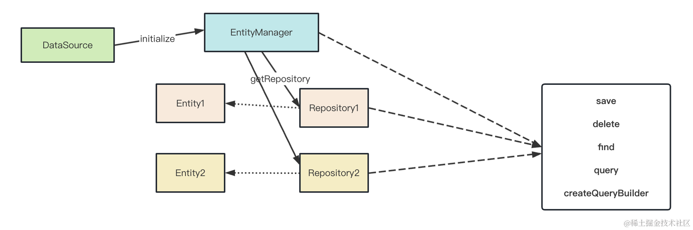

# nest-typeorm

## TypeORM 的流程


DataSource 里存放着数据库连接的配置，比如用户名、密码、驱动包、连接池配置等等。

而 Entity 里通过 @Entity、@PrimaryGeneratedColumn、@Column 等装饰器来建立数据库表的映射关系。

同时还有 Entity 之间的 @OneToOne、@OneToMany、@ManyToMany 的关系，这些会映射成数据库表通过外键、中间表来建立的关系。

DataSource.initialize 的时候，会和数据库服务建立连接，如果配置了 synchronize，还会生成建表 sql 语句来创建表。

DataSource 初始化之后就可以拿到 EntityManager 了，由它负责对各种 Entity 进行增删改查，比如 find、delete、save 等方法，还可以通过 query builder 来创建复杂的查询。

如果你只是想做对单个 Entity 的 CRUD，那可以拿到这个 Entity 的 Repository 类，它同样有上面的那些方法，只是只能用来操作单个 Entity。

这就是 TypeORM 的流程。


## 命令
```bash
# 创建个 Nest 项目
nest new nest-typeorm -p npm

# 然后创建一个 crud 的模块
nest g resource user

# 引入 typeorm 来实现下
npm install --save @nestjs/typeorm typeorm mysql2

# 运行
npm run start:dev
```


## 总结
我们会了用 TypeOrm 来连接和增删改查数据库表，在 Nest 里集成只是对 TyprOrm 的 api 封装了一层。

使用方式是在根模块 TypeOrmModule.forRoot 传入数据源配置。

然后就可以在各处注入 DataSource、EntityManager 来做增删改查了。

如果想用 Repository 来简化操作，还可以在用到的模块引入 TypeOrmModule.forFeature 的动态模块，传入 Entity，会返回对应的 Repository。

这样就可以在模块内注入该 Repository 来用了。

它的原理是 TypeOrmModule.forRoot 对应的动态模块是全局的，导出了 dataSource、entityManager，所以才可以到处注入。

而 TypeOrmModule.forFeature 则会根据吧传入 Entity 对应的 Repository 导出，这样就可以在模块内注入了。

这就是 Nest 里集成 TypeOrm 的方式和实现原理。

至此，我们就可以打通从请求到数据库的流程了。
