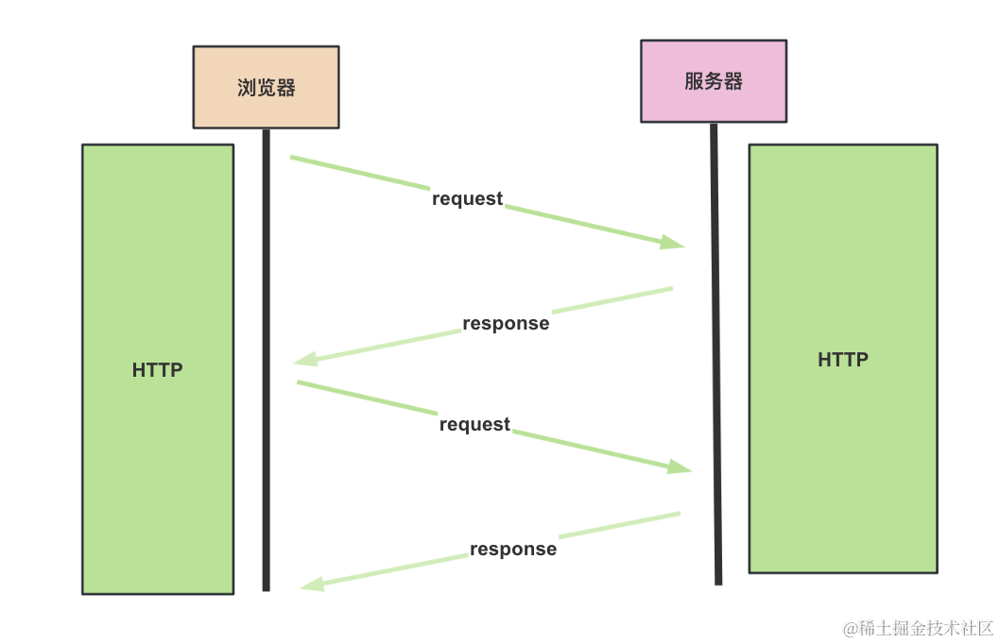

# Nest 开发 WebSocket 服务


## 命令
```bash
# 创建个项目
nest new nest-websocket

# 安装用到的包
npm i --save @nestjs/websockets @nestjs/platform-socket.io

# 创建个 websocket 模块
# 选择 WebSockets
nest g resource aaa

# 安装 socket.io（Nest 默认使用 socket.io 包实现 WebSocket 功能）
npm install socket.io
```


## 网络协议
### HTTP，它是一问一答的模式，客户端发送请求，服务端返回响应



###  Server Sent Event，它是基于 HTTP 的，客户端发送请求，服务端返回 text/event-stream 类型的响应，可以多次返回数据
但是 HTTP 不能服务端向客户端推送数据，SSE 适合一次请求之后服务端多次推送数据的场景。


### 实时的双向通信的场景，还是得用 WebSocket


## 总结
这节我们学习了 Nest 实现 WebSocket 服务。

需要用到 @nestjs/websockets 和 @nestjs/platform-socket.io 包。

涉及到这些装饰器：
- @WebSocketGateWay：声明这是一个处理 weboscket 的类。
- @SubscribeMessage：声明处理的消息。
- @MessageBody：取出传过来的消息内容。
- @WebSocketServer：取出 Socket 实例对象
- @ConnectedSocket：取出 Socket 实例对象注入方法

客户端也是使用 socket.io 来连接。

如果想异步返回消息，就通过 rxjs 的 Observer 来异步多次返回。

整体来说，Nest 里用 WebSocket 来做实时通信还是比较简单的。

