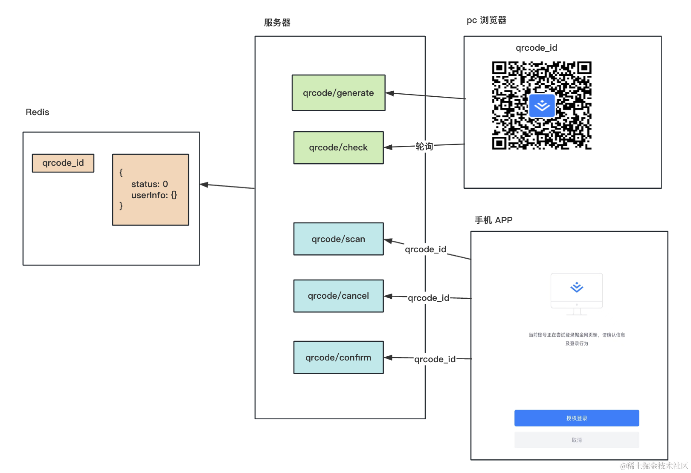

# 实现扫二维码登录


## 命令
```bash
# 创建个 nest 项目
nest new qrcode-login

# 安装生成二维码用到的包
npm install qrcode @types/qrcode

# 引入 jwt 的 包
npm install @nestjs/jwt
```


## 总结
扫码登录是常用的功能，掘金、知乎、b 站等各大网站都有。

流程是在 pc 选择扫码登录的方式，用 APP 扫码，在 app 上登录之后进入登录确认页面。

可以点击确认登录或者取消，如果确认登录，那 pc 网站就会自动登录该账号。

它的实现原理是这样的：



pc 端生成二维码，然后不断轮询二维码状态。

APP 里扫码拿到 qrcode_id，然后分别调用 scan、confirm、cancel 来修改二维码状态。

并且登录之后会把 token 带过去。

在 redis 里保存着二维码的状态和用户信息，然后这边确认之后，另一边就可以用 userInfo 生成 jwt 的 token，从而实现登录。

这就是扫码登录的实现原理。
