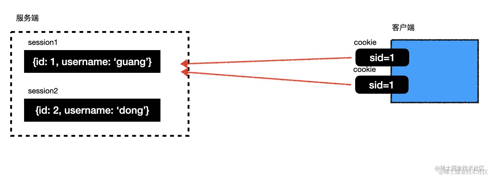
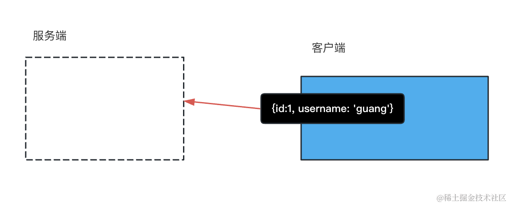
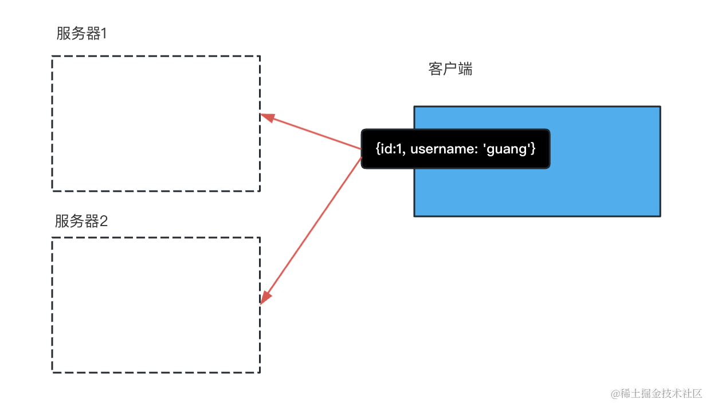
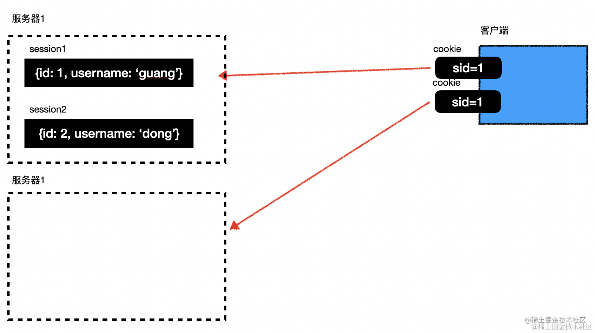
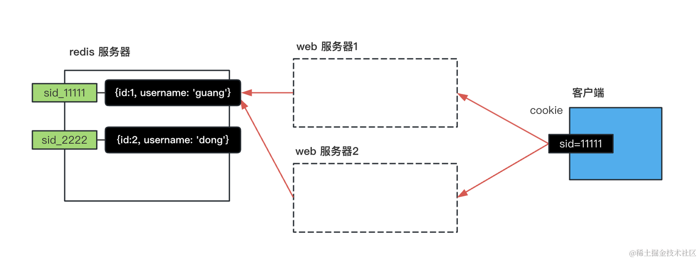
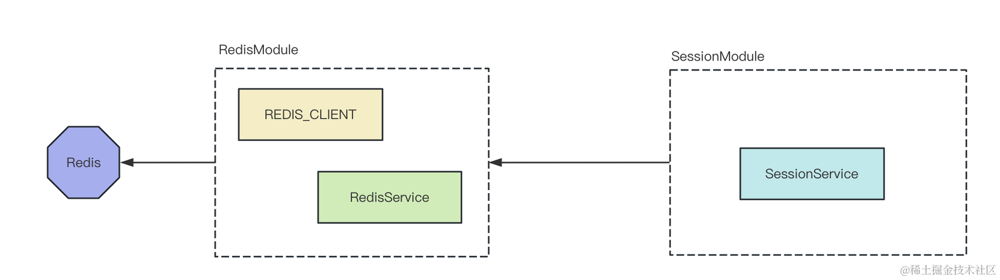
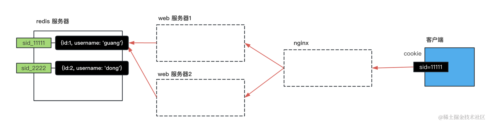

# 基于 Redis 实现分布式 session

redis 的 hash 有这些方法：
- HSET key field value： 设置指定哈希表 key 中字段 field 的值为 value。
- HGET key field：获取指定哈希表 key 中字段 field 的值。
- HMSET key field1 value1 field2 value2 ...：同时设置多个字段的值到哈希表 key 中。
- HMGET key field1 field2 ...：同时获取多个字段的值从哈希表 key 中。
- HGETALL key：获取哈希表 key 中所有字段和值。
- HDEL key field1 field2 ...：删除哈希表 key 中一个或多个字段。
- HEXISTS key field：检查哈希表 key 中是否存在字段 field。
- HKEYS key：获取哈希表 key 中的所有字段。
- HVALUES key：获取哈希表 key 中所有的值。 -HLEN key：获取哈希表 key 中字段的数量。
- HINCRBY key field increment：将哈希表 key 中字段 field 的值增加 increment。
- HSETNX key field value：只在字段 field 不存在时，设置其值为 value。


session 是在服务端保存用户数据，然后通过 cookie 返回 sessionId。cookie 在每次请求的时候会自动带上，服务端就能根据 sessionId 找到对应的 session，拿到用户的数据


而 jwt 是把所有的用户数据保存在加密后的 token 里返回，客户端只要在 authorization 的 header 里带上 token，服务端就能从中解析出用户数据。


jwt 天然是支持分布式的，比如有两个服务器的时候，任何一个服务器都能从 token 出拿到用户数据：


但是 session 的方式不行，它的数据是存在单台服务器的内存的，如果再请求另一台服务器就找不到对应的 session 了：


首先我们来分析下思路：

分布式 session 就是在多台服务器都可以访问到同一个 session。

我们可以在 redis 里存储它：


然后再封装个 SessionModule:


而且这个 session 是支持分布式的:



## 命令
```bash
# 创建 nest 项目
nest new redis-session-test -p npm

# 安装 redis 的包
npm install --save redis

# 创建个 redis 模块
nest g module redis
nest g service redis

# 再封装个 SessionModule
nest g module session
nest g service session --no-spec

# 用到 cookie，需要安装 cookie-parser 的包
npm install --save cookie-parser
```


## 总结
session 是在服务端内存存储会话数据，通过 cookie 中的 session id 关联。

但它不支持分布式，换台机器就不行了。

jwt 是在客户端存储会话数据，所以天然支持分布式。

我们通过 redis 自己实现了分布式的 session。

我们使用的是 hash 的数据结构，封装了 RedisModule 来操作 Redis。

又封装了 SessionModule 来读写 redis 中的 session，以 sid_xxx 为 key。

之后在 ctronller 里就可以读取和设置 session 了，用起来和内置的传统 session 差不多。但是它是支持分布式的。

如果你想在分布式场景下用 session，就自己基于 redis 实现一个吧。
