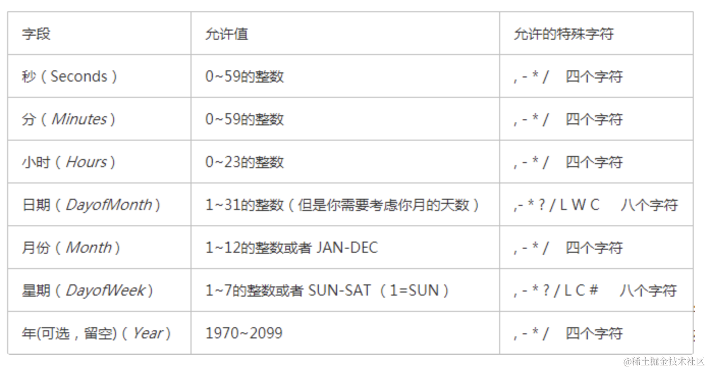

# Nest 的 3 种定时任务


## 命令
```bash
# 新建个 nest 项目
nest new schedule-task

# 然后安装定时任务的包
npm install --save @nestjs/schedule

# 创建个 service
nest g service task --flat --no-spec

# 创建个 aaa 模块
nest g resource aaa

# 自己创建定时任务，需要安装 cron 的包
npm install --save cron
```


## 概念
cron 表达式有这 7 个字段：


其中年是可选的，所以一般都是 6 个。

[时区的名字可以在这里查](https://momentjs.com/timezone/)


## 总结
这节我们学习了定时任务，用到 @nestjs/scheduler 这个包。

主要有 cron、timeout、interval 这 3 种任务。

其中 cron 是依赖 cron 包实现的，而后两种则是对原生 api 的封装。

我们学习了 cron 表达式，还是挺复杂的，当然，你也可以直接用 CronExpression 的一些常量。

此外，你还可以注入 SchedulerRegistery 来对定时任务做增删改查。

定时任务里可以注入 service，来定时执行一些逻辑，在特定业务场景下是很有用的。
