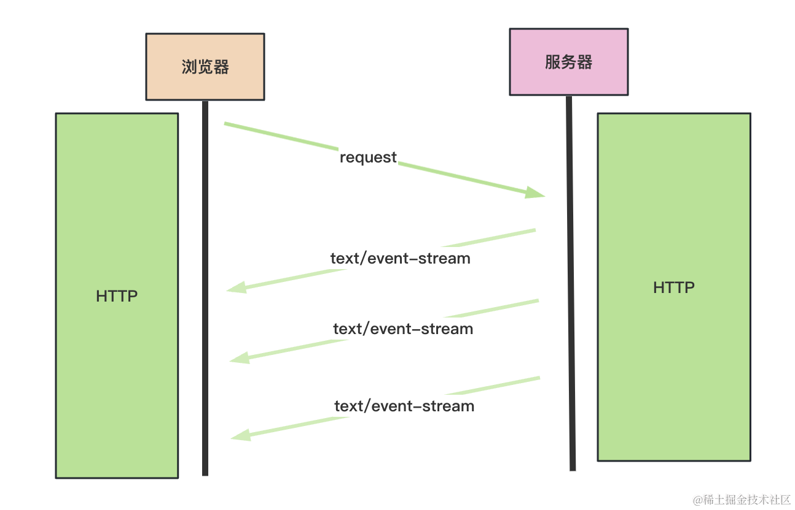

# Nest 实现 Server Sent Event 数据推送


## Server Sent Event(消息推送)
### WebSocket 的通信过程是这样的


首先通过 http 切换协议，服务端返回 101 的状态码后，就代表协议切换成功。

之后就是 WebSocket 格式数据的通信了，一方可以随时向另一方推送消息。


### 而 HTTP 的 Server Sent Event 是这样的


服务端返回的 Content-Type 是 text/event-stream，这是一个流，可以多次返回内容。


## 命令
```bash
# 创建 nest 项目
nest new sse-test
```


## 总结
服务端实时推送数据，除了用 WebSocket 外，还可以用 HTTP 的 Server Sent Event。

只要 http 返回 Content-Type 为 text/event-stream 的 header，就可以通过 stream 的方式多次返回消息了。

它传输的是 json 格式的内容，可以用来传输文本或者二进制内容。

我们通过 Nest 实现了 sse 的接口，用 @Sse 装饰器标识方法，然后返回 Observe 对象就可以了。内部可以通过 observer.next 随时返回数据。

前端使用 EventSource 的 onmessage 来接收消息。

这个 api 的兼容性很好，除了 ie 外可以放心的用。

它的应用场景有很多，比如站内信、构建日志实时展示、chatgpt 的消息返回等。

再遇到需要消息推送的场景，不要直接 WebSocket 了，也许 Server Sent Event 更合适呢？
