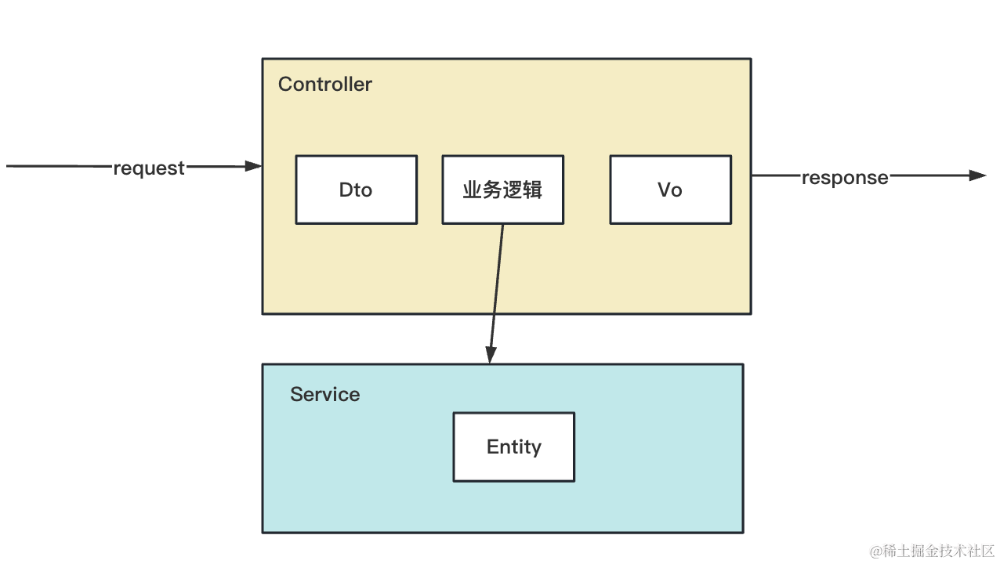

# API 接口文档 swagger


## 介绍

dto 是 data transfer object，用于参数的接收。

vo 是 view object，用于返回给视图的数据的封装。

而 entity 是和数据库表对应的实体类。


## 命令
```bash
# 新建个项目
nest new swagger-test -p npm

# 安装 swagger 的包
npm install --save @nestjs/swagger
```


## 总结
这节我们学习了 swagger 自动生成文档。

需要先安装 @nestjs/swagger 的包。

然后在 main.ts 里用 DocumentBuilder + SwaggerModule.createDocuemnt 创建 swagger 文档配置，然后 setup 跑起来就好了。

还需要手动加一些装饰器来标注：
- ApiOperation：声明接口信息
- ApiResponse：声明响应信息，一个接口可以多种响应
- ApiQuery：声明 query 参数信息
- ApiParam：声明 param 参数信息
- ApiBody：声明 body 参数信息，可以省略
- ApiProperty：声明 dto、vo 的属性信息
- ApiPropertyOptional：声明 dto、vo 的属性信息，相当于 required: false 的 ApiProperty
- ApiTags：对接口进行分组
- ApiBearerAuth：通过 jwt 的方式认证，也就是 Authorization: Bearer xxx
- ApiCookieAuth：通过 cookie 的方式认证
- ApiBasicAuth：通过用户名、密码认证，在 header 添加 Authorization: Basic xxx

swagger 是 openapi 标准的实现，可以在 url 后加个 -json 拿到对应的 json，然后导入别的接口文档平台来用。

绝大多数公司的接口文档都是用 swagger 来自动生成的，不然手动维护太麻烦了。

而且 swagger 还可以方便的测试接口，自动添加身份认证等。
