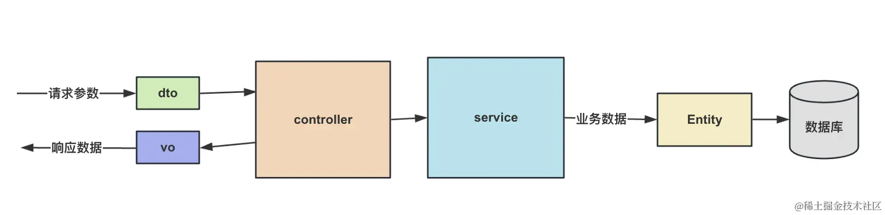

# 序列化 Entity，你不需要 VO 对象


## 后端系统常见的对象有三种：
Entity：数据实体，和数据库表对应。

DTO： Data Transfer Object，用于封装请求参数。

VO：Value Object，用于封装返回的响应数据。

三者的关系如下：



## 命令
```bash
# 创建项目
nest new vo-test

# 生成一个 user 的 CRUD 模块
nest g resource user --no-spec

npm install --save class-transformer

npm install --save @nestjs/swagger
```


## 总结
后端系统中常见 entity、vo、dto 三种对象，vo 是用来封装返回的响应数据的。

但是 Nest 文档里并没有提到 vo 对象，因为完全可以用 entity 来代替。

entity 里加上 @Exclude 可以排除某些字段、@Expose 可以增加一些派生字段、@Transform 可以对已有字段的序列化结果做修改。

然后在 cotnroller 上加上 ClassSerializerInterceptor 的 interceptor，还可以用 @SerializeOptions 来添加 options。

它的底层是基于 class-transfomer 包来实现的，拿到响应对象，plainToClass 拿到 class，然后根据 class 的装饰器再 classToPlain 创建序列化的对象。

swagger 的 @ApiResponse 也完全可以用 entity 来代替 vo，在想排除的字段加一下 @ApiHideProperty 就好了。

Nest 文档里并没有提到 vo 对象，因为完全没有必要，可以直接用序列化的 entity。
